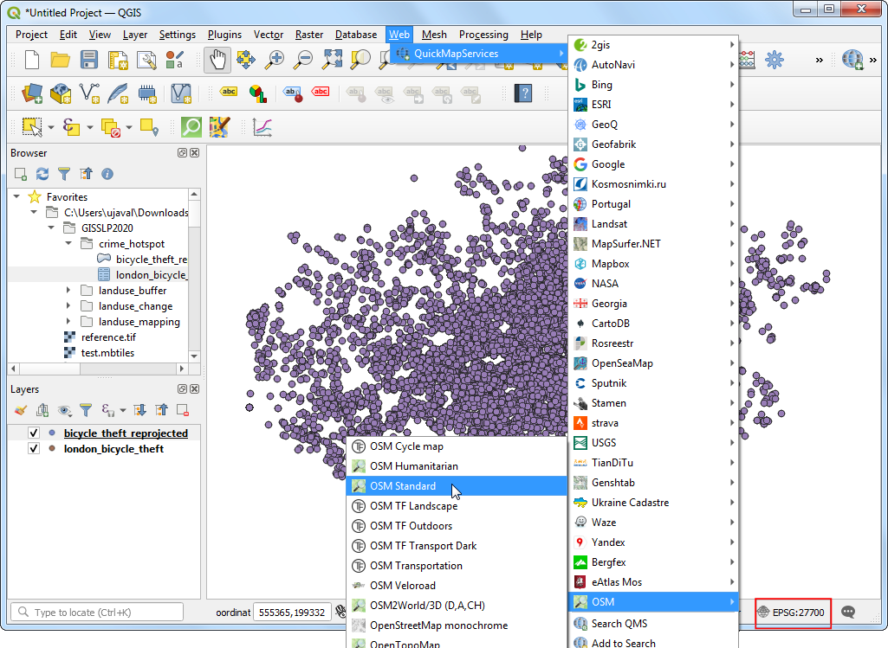
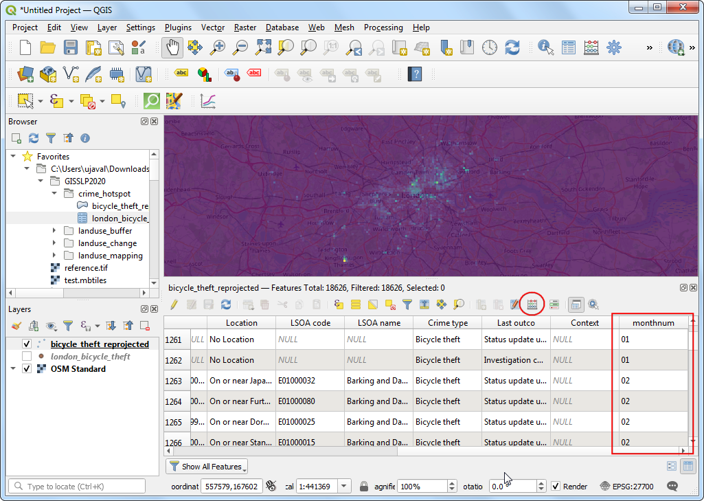
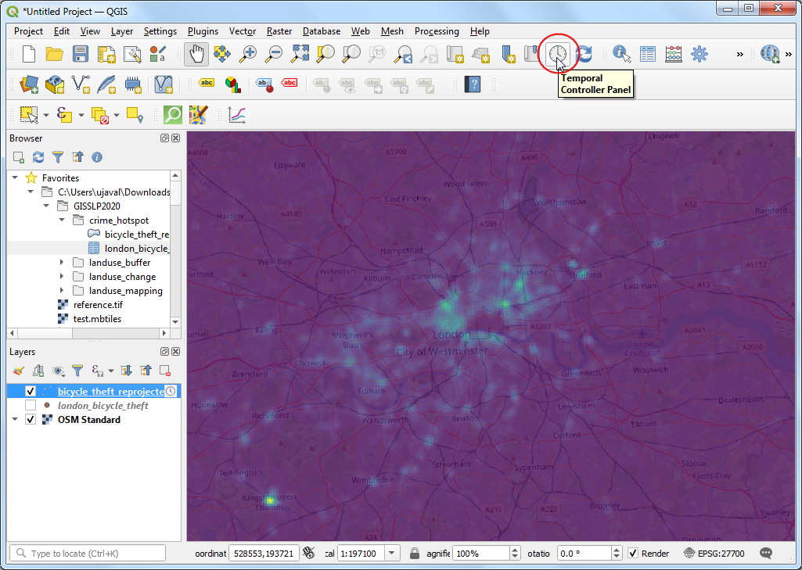

\newpage

\tableofcontents

\pagenumbering{arabic} 

\newpage

## Exercise Overview

This lab explores the techniques to work with dense point dataset - such as crime incidents. We will take a dataset of bicycle robberies in Greater London area and identify high-crime-density areas. We will also see how we can explore the 'temporal' dimension on the data and see how the hotspots change month-to-month.

### Analysis Outputs

* A map showing hotspots of bicycle thefts in the City of London.
* Series of maps showing changes in hotspots for every month of the year.

```{r echo=FALSE, fig.align='center', out.width='75%'}
knitr::include_graphics('images/crime_hotspot_map.png')
```

### Datasets

* *Bicycle Theft Locations in Greater London*: Point locations for 2019 provided by data.police.uk. Available as `bicycle_theft_2019.csv`

Download the data package file `crime_hotspot.zip` and unzip it to a directory on your computer. It is recommended to create a common data folder for this course and keep the materials there. You can unzip them to `<home directory>/Downloads/urban_planning/`

### Software and Plugins

This exercise uses QGIS v3.14 or above.

\newpage

## Identifying Hotspots

1. Open QGIS. Click *Open Data Source Manager*.

```{r echo=FALSE, fig.align='center', out.width='75%'}

```

2. Click the *...* button next to *File name* and browse to the `crime_hotspot/` directory and select the `london_bicyle_theft.csv` file. The CSV file contains coordinates in the *Longitude* and *Latitude* columns. QGIS will auto-detect them and select them as *X field* and *Y field* respectively. Verify the *Sample Data* preview at the bottom and click *Add*.

```{r echo=FALSE, fig.align='center', out.width='75%'}

```

3. A new layer *london_bicyle_theft* will be added to the canvas. This layer represents all point locations in the city of London where a bicycle theft was reported in the year 2019. The coordinates come in a Geographic CRS `EPSG:4326`. Let's reproject it so we can carry out our analysis in linear units.Go to *Processing &rarr; Toolbox* and search for *Reproject layer* tool. Double-click to open it.

```{r echo=FALSE, fig.align='center', out.width='75%'}

```

4. Search and select `EPSG:27700 - OSGB 1936 / British National Grid` as the *Target CRS* - which is the preferred projected CRS for UK. Save the resulting layer as `bicycle_theft_reprojected.shp`. Click *Run*.

```{r echo=FALSE, fig.align='center', out.width='75%'}

```

5. Once the processing finishes, a new layer `bicycle_theft_reprojected` will be added. Right-click on it and select *Layer CRS &rarr; Set Project CRS from layer*. This will set the project CRS also to `EPSG:27700 - OSGB 1936 / British National Grid`.

```{r echo=FALSE, fig.align='center', out.width='75%'}

```

6.  It would be helpful to see these crime incidents in context with a basemap. We have access to a variety of base-maps from the *QuickMapServices* plugin. Go to *Web &rarr; QuickMapServices &rarr; OSM &rarr; OSM Standard* to add the OpenStreetMap layer.

```{r echo=FALSE, fig.align='center', out.width='75%'}

```

7. Zoom in and explore the data. The source data is anonymized and shifted from its true coordinates to the nearest point from a **[master list of anonymous map points](https://data.police.uk/about/#location-anonymisation)**. Therefore there are many overlapping points at the same location - making it difficult to visually spot the clusters. Click the *Open Layer Styling Panel* button and select the *Point Cluster* renderer which will show the point count for each location.

```{r echo=FALSE, fig.align='center', out.width='75%'}

```

8. Now you can visually see the point clusters. While this is useful in local exploration of the data, it doesn't help us identify the hotspots. We can change the renderer to *Heatmap*.

```{r echo=FALSE, fig.align='center', out.width='75%'}

```

9. Once you have selected the *Heatmap* renderer, select a *Color Ramp*.

```{r echo=FALSE, fig.align='center', out.width='75%'}

```

10. Change the *Radius* parameter to `500`  `Map Units` - which is equivalent to 500m. You will now be able to identify the hotspots easily. This method of identification of hotspot is known as 'Kernel Density Estimation (KDE)'

```{r echo=FALSE, fig.align='center', out.width='75%'}

```

11. We can change the transparency to see the basemap along with the hotspots. Expand the *Layer Rendering* section and change the *Opacity* yo `75%`. You can now see which neighborhoods of the city have high concentration of crime.

```{r echo=FALSE, fig.align='center', out.width='75%'}

```

## Visualizing Hotspots Over Time

Crime has spatial as well as temporal pattern. There are some regions that may see seasonal spikes in crime and other that may have high crime incidents throughout the year. QGIS has built-in support for handling time series data. We will now explore how we can visualize crime month-over-month.

1. Open the *Attribute Table* of the `bicycle_theft_reprojected` layer. You will see that each crime incident has an attribute `Month` indicating which month that incident took place. The *Temporal Controller* in QGIS needs a column of type *Date* in the attribute table. We can extract the month number from the *Month* field and create a new date field. Click the *Field Calculator* button.

```{r echo=FALSE, fig.align='center', out.width='75%'}

```

2. Check the *Create virtual field* check-box. This is a very useful option which will not modify your dataset's attribute table, but create a new column that is saved inside the QGIS project. Enter `monthnum` as the *Output field name* and `Text (string)` as the *Output field type*. Enter the following expression to extract just the month part of the value. Note that in QGIS expressions, text with double-quotes refer to field names.

```
substr("Month", 6, 2)
```

```{r echo=FALSE, fig.align='center', out.width='75%'}

```

3. If you open the attribute table again, you will see a new column `monthnum` with just the month number. We can now use the value in this column to construct a date for the incident. Click the *Field Calculator* button again.

```{r echo=FALSE, fig.align='center', out.width='75%'}

```

4. Check the *Create virtual field* option and enter `crimedate` as the *Output field name*. Select `Date` as the *Output field type*. We don't know the exact date of the crime, just the month. We can assign the 15th of the month as the crime date. This will also help us in month-to-month navigation later. Enter the following expression:

```
make_date(2019, "monthnum", 15)
```

```{r echo=FALSE, fig.align='center', out.width='75%'}

```

5. Now we have a *Date* field in the attribute table that has the approximate date for each incident. Right-click the `bicycle_theft_reprojected` layer and select *Properties*.

```{r echo=FALSE, fig.align='center', out.width='75%'}

```

6. Switch to the *Temporal* tab. Check the *Temporal* check-box and select `Single Field with Dat/Time` as the *Configuration*. Select `crimedate` as the *Field* and click *OK*.

```{r echo=FALSE, fig.align='center', out.width='75%'}

```

7. A clock icon will appear next to the `bicycle_theft_reprojected` layer indicating that this layer is configured with temporal configuration. Click the *Temporal Controller Panel* button on the *Map Navigation Toolbar*.

```{r echo=FALSE, fig.align='center', out.width='75%'}

```

8. Click the *Animated Temporal Navigation* button. Enter *Range* as `2019-01-01` to `2019-12-16`.

```{r echo=FALSE, fig.align='center', out.width='75%'}

```

9. Select `1` `months` as the *Step*. Click the *Play* button to see the map update and animate through the hotspot for each month.

```{r echo=FALSE, fig.align='center', out.width='75%'}

```

10. You can click the *Save* button in the *Temporal Controller* panel and save the resulting animation as 1 image / month on your computer.  Now let’s create an animated GIF from these images. There are many options for creating animations from individual image frames. I like ] for an easy and online tool. Visit the site and click Choose Files and select all the .png files. Once selected, click the Upload and make a GIF! The website offers many options for controlling how your animated GIF appears. Explore them and create an animation of bicycle theft hotspots.

\newpage

## Suggested Reading

* [Mapping Crime Hotspots](https://www.researchgate.net/publication/32894301_Mapping_Crime_Understanding_Hot_Spots): Eck, J.E. and Chainey, S. and Cameron, J.G. and Leitner, M. and Wilson, R.E. (2005) Mapping crime: understanding hot spots. Research report. National Institute of Justice, US.


## Data Credits

* London Individual crime and anti-social behaviour (ASB) incidents, including street-level location information and subsequent police and court outcomes associated with the crime. Published by Single Online Home National Digital Team under Open Government Licence v3.0. Downloaded from https://data.police.uk/

***

&copy; 2021 Ujaval Gandhi