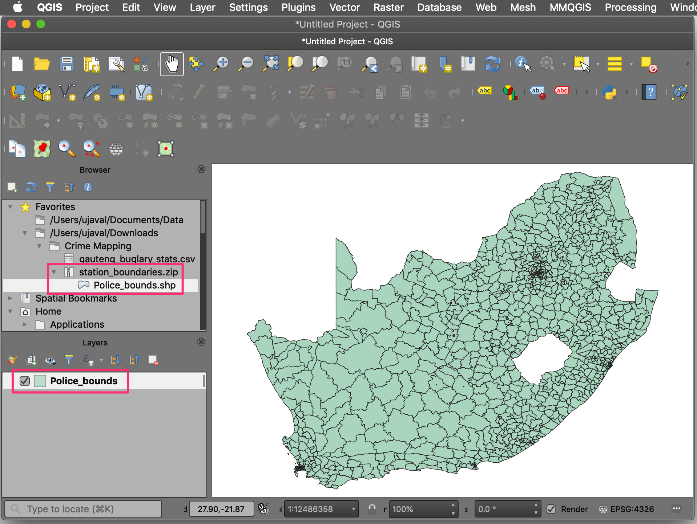
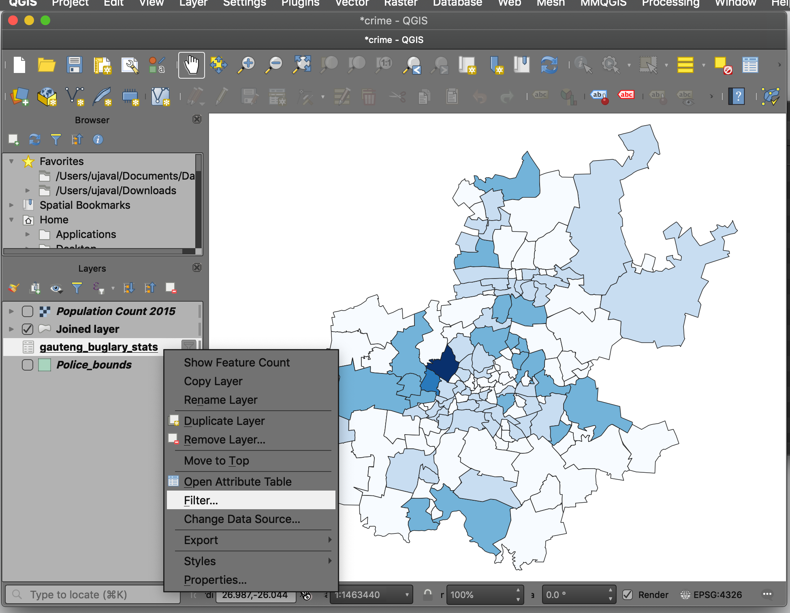

\newpage

\tableofcontents

\pagenumbering{arabic} 

\newpage

## Exercise Overview

We will be exploring how crime statistics can be visualized and mapped. We have a crime statistics
dataset for burglaries in the Gauteng province spanning 10 years and aggregated by police stations. We
will learn a variety of statistical and GIS techniques to derive insights from the dataset to find spatial and well as temporal patterns. At the end of the exercise we will be able to use data, statistics and perform various analysis and mapping techniques for crime and safety analysis.

### Analysis Outputs

* A map of burglary rate per 100,000 population
* A time-series chart of burglaries by residential and non-residential burglaries

### Datasets

* *SAPS Station Boundaries and Points*: Provided by South African Police Service (SAPS). Shapefiles are available as ``station_boundaries.zip``
* *Crime Statistic of Republic of South Africa*:  Provided by South African Police Service (SAPS). Source data is processed and a subset is available as ``gauteng_buglary_stats.csv``.
* *AfriPop Population Counts 2015*: Provided by WorldPop. GeoTiff file is available as ``worldpop_south_africa.zip``

Download the data package file `crime_mapping.zip` and unzip it to a directory on your computer. It is recommended to create a common data folder for this course and keep the materials there. You can unzip them to `<home directory>/Downloads/urban_planning/`

### Software and Plugins

This exercise uses QGIS v3.16 or above with following plugins

* Data Plotly

\newpage
  
## Exploring and Mapping Crime Data

1. Use the QGIS Browser Panel to locate the data package. Expand the ``station_boundaries.zip`` file and drag the ``Police bounds.shp`` to the canvas. This file contains the polygon boundaries for all police stations in South Africa.  
 
```{r echo=FALSE, fig.align='center', out.width='75%'}

```

2. Select the *Identify* tool in the *Attributes Toolbar* and click on any polygon. The *Identify Results* panel on the right will display the attributes. The name of the police station is stored in the ``COMPNT_NM`` column.

```{r echo=FALSE, fig.align='center', out.width='75%'}

```

3. Next, let's add the crime statistics data. This data comes as a plain text file in the Comma Separated Values (CSV) format. To import it, click the *Open Data Source Manager* button. In the *Data Source Manager* window, switch to the *Deletemited Text* tab.

```{r echo=FALSE, fig.align='center', out.width='75%'}
knitr::include_graphics('images/crime3.png')
```

4. Browse to the downloaded ``gauteng_buglary_stats.csv`` file and click *OK*. Select ``CSV`` as the *File Format*. As the data is just tabular data, select ``No geometry`` under *Geometry Definition*. Check the *Sample Data* shown at the bottom and click *Add*.

```{r echo=FALSE, fig.align='center', out.width='75%'}

```

5. A new layer ``gauteng_buglary_stats`` will be added to the *Layers* panel. Click on the *Open Attribute Table* button.

```{r echo=FALSE, fig.align='center', out.width='75%'}

```

6. You will see the full dataset in the table. Each row contains Residential/Non Residential/Total burglaries for a police station for a year. There are 143 police stations in the Gauteng province and we have data 10 years (2006-2015) - so the table contains 143 x 10 = 1430 rows.

```{r echo=FALSE, fig.align='center', out.width='75%'}

```

7. We will now map the burglary distribution for a single year. To select the rows for a particular year, we can apply a filter. Back in the main QGIS window. Right-click the ``gauteng_buglary_stats`` layer and select *Filter*.

```{r echo=FALSE, fig.align='center', out.width='75%'}
knitr::include_graphics('images/crime7.png')
```

8. Enter the following expression in the *Query Builder*. You can also interactively build the expression by double-clicking the ``YEAR`` field, followed by ``=`` operator, and selecting ``2015`` from the *Values*. Click *OK*. Check the *Attribute Table* and verify that there are only 143 records - all for the year 2015.

```
"YEAR" = 2015
```

```{r echo=FALSE, fig.align='center', out.width='75%'}

```

9. To map the data, we need to join the tabular data to the polygon layer. This operation is called a **Table Join**. Table joins are performed in QGIS by the Processing Toolbox. Open it from **Processing &rarr; Toolbox**.

```{r echo=FALSE, fig.align='center', out.width='75%'}

```

10. Search and locate the **Vector general &rarr; Join attributes by field value** algorithm. Double-click to open it.

```{r echo=FALSE, fig.align='center', out.width='75%'}

```

11. Select ``Police bounds`` as the *Input layer* and ``COMPNT_NM`` as the *Table Field*. We want to join the filtered table to this layer. So select ``gauteng_burglary_stats`` as the *Input layer 2* and ``Station`` as the *Table field 2*. The original layer has polygons for entire South Africa but the table contains records only for Gauteng province. So check the *Discard records which could not be joined* box. Next, click the ``...`` button next to *Joined Layer* and select ``Save to File...`.

```{r echo=FALSE, fig.align='center', out.width='75%'}

```

12. Name the output file as ``gauteng_buglaries_2015.gpkg``. Click *Run*.

```{r echo=FALSE, fig.align='center', out.width='75%'}

```

13. As the algorithm runs, you will see the log message which will indicate that 143 features were matched. Click *Close*.

```{r echo=FALSE, fig.align='center', out.width='75%'}

```

14. A new layer ``gauteng_buglaries_2015`` will be added to the *Layers* panel. Explore this new layer with the *Identify* tool and you will see that the original polygon layer is now enhanced with new columns. Let's style this layer with the data from the new column. Click the *Open the Layer Styling Panel* button in the *Layers* panel. The *Layer Styling Panel* will open on the right-hand side.

```{r echo=FALSE, fig.align='center', out.width='75%'}

```

15. Select the ``Graduated`` renderer. We will categorize the polygons based on the total burglaries, so select ``Total`` as the *Value*. Select a color ramp of your choice from the *Color ramp* dropdown. Change the *Mode* to ``Equal Count (Quantile)`` and click *Classify*. Close the *Layer Styling Panel*. Explore the spatial distribution of the burglaries. This type of visualization is known as a **Choropleth** map.

```{r echo=FALSE, fig.align='center', out.width='75%'}

```

\newpage

## Mapping Crime Rate

In the previous section, we mapped total burglaries per police station boundary. This doesn't account for different sizes of the region and the population within each police station boundary.  If 2 police stations that have a very different coverage area and population but have the same number of crimes - they will be represented by the same class.  To create an accurate visualization, we must normalize the total burglaries with the population and compute **Crime Rate** for each police station.


1. WorldPop provides population estimates for 2015 population for South Africa. We have a raster file where each pixel of 100m x 100m represents the total population residing within that area. Locate the ``worldpop_south_africa.zip`` file in the *Browser* panel and expand it. Drag the ``ZAP15v4.tif`` file to the canvas.

```{r echo=FALSE, fig.align='center', out.width='75%'}

```

2. A new layer ``ZAP15v4`` will be added to the *Layers* panel. Use the *Identify* tool and click anywhere on the canvas and explore the data. You will see the values contained in *Band 1* are the population count.

```{r echo=FALSE, fig.align='center', out.width='75%'}

```

3. We need to find the total population for each of the police station polygons. We will use a GIS technique called **Zonal Statistics** to sample each pixel value from the raster and aggregate them for each polygon. Open the *Processing Toolbox*. Search for and locate the **Raster analysis &rarr; Zonal statistics** algorithm. Double-click to open it.

```{r echo=FALSE, fig.align='center', out.width='75%'}

```

4. In the *Zonal Statistics* dialog, select ``ZAF15v4`` as the *Raster Layer*. The *Vector layer containing zones* will be ``gauteng_buglaries_2015``. Enter ``Population_`` as the *Output column prefix*. We are interested only in the total population, so select only ``Sum`` as the *Statistics to calculate*. Save the output file as  `gauteng_burgalaries_pop_2015.gpkg`. Click *Run*.

```{r echo=FALSE, fig.align='center', out.width='75%'}

```

5. Once the algorithm finishes, switch to the main QGIS window. Turn off the visibility of the ``ZAF15v4`` layer. Use the *Identify* tool to click on any polygon from the ``gauteng_burgalaries_pop_2015`` layer. You will notice a new column called ``Population_sum`` that contains the population derived from the raster layer.

```{r echo=FALSE, fig.align='center', out.width='75%'}

```

6. Now we have both the total burglaries and total population per police station polygon. So we can calculate the *burglary rate*. Search for and locate the  **Vector table &rarr; Field calculator** algorithm. Double-click to launch it.

```{r echo=FALSE, fig.align='center', out.width='75%'}

```

7. In the *Field calculator* window, select `gauteng_burgalaries_pop_2015` as the *Input layer*. Click the `...` button next to *Output file* and save the file as ``gauteng_burglary_rate.gpkg``. Name the new field as `CrimeRate`. Enter the following expression to calculate burglary per 100000 residents. Click *OK*.

```
100000*("Total"/"Population_sum")
```

```{r echo=FALSE, fig.align='center', out.width='75%'}

```

8. A new layer ``gauteng_buglary_rate`` will be added to the *Layers* panel. Apply a Graduated style on the layer using the newly computed ``CrimeRate`` column. 

```{r echo=FALSE, fig.align='center', out.width='75%'}

```

9. The final map shows the crime rate per 100,000 residents in the Gauteng province.

```{r echo=FALSE, fig.align='center', out.width='75%'}

```

\newpage

## Calculating Statistics and Charting

Apart from mapping, the data can be summarized on a variety of interesting ways. One way is to calculate the total burglaries for each year to see what is the trend - whether the burglaries are on the rise, fall or are steady? 

1. Remove the filter on the table that was applied earlier. Click on the *Filter* icon next to the ``gauteng_buglary_stats`` layer.

```{r echo=FALSE, fig.align='center', out.width='75%'}

```

2. Delete the previously entered expression in the *Query Builder*. Click *OK*.

```{r echo=FALSE, fig.align='center', out.width='75%'}

```

3. We will now create 2 new tables - summarizing the total residential and non residential burglaries by year. Open the *Processing Toolbox*. Search and locate the **Vector analysis &rarr; Statistics by categories** algorithm. Double-click to open it. 

```{r echo=FALSE, fig.align='center', out.width='75%'}

```

4. Select ``gauteng_buglary_stats`` as the *Input* layer. Select ``Residential`` as the *Field to calculate statistics on*. As we want to aggregate the statistics by year, select ``Year`` as the *Field(s) with categories*.

```{r echo=FALSE, fig.align='center', out.width='75%'}

```

5. Select *Save to File* for the output layer and enter the name as ``residential_burglaries_by_year.csv``. Click *Run*.

```{r echo=FALSE, fig.align='center', out.width='75%'}

```

6. Once the processing finishes, in the same dialog, change the *Field to calculate statistics on* to ``Non Residential`` and name the output as ``non_residential_burglaries_by_year.csv``. Click *Run*. Close the window once the processing finishes.

```{r echo=FALSE, fig.align='center', out.width='75%'}

```

7. You will see 2 new tabular layers added to the *Layers* panel. Open the *Attribute Table* and note that the table contains 10 rows - one for each year. There are various statistics computed on the source data. The one we are interested in is the **sum** - which has the total count of burglaries for the selected field.

```{r echo=FALSE, fig.align='center', out.width='75%'}

```

8. We will now create a chart showing the data in these 2 tables. We will use the **Data Plotly** plugin that provides interactive charts in QGIS. Once the plugin is installed, go to **Plugins &rarr; Data Plotly &rarr; DataPlotly**.

```{r echo=FALSE, fig.align='center', out.width='75%'}

```

9. A new *DataPlotly* panel will open on the right. Select ``Bar Plot`` as the *Plot type*. Select ``residential_burglaries_by_year`` as the *Layer*. Choose ``Year`` as the *X field* and ``sum`` as the *Y Field*. Choose a color of your liking as the *Bar color* and *Stroke color*. 

```{r echo=FALSE, fig.align='center', out.width='65%'}

```

10. Switch to the *Settings* tab, and enter the *Plot title* as ``Burglaries By Year``. Enter the *Legend title* as ``Residential``. Change the *Y label* to ``Burglaries``. Click *Create Plot* at the bottom.

```{r echo=FALSE, fig.align='center', out.width='75%'}

```

11. A bar chart will be displayed in the *Chart* tab. 

```{r echo=FALSE, fig.align='center', out.width='65%'}

```

12. Switch to the first tab and change the *Layer* to ``non_residential_burglaries_by_year``. Select a different *Bar color* and *Stroke color*. Switch to the *Settings* tab.

```{r echo=FALSE, fig.align='center', out.width='65%'}

```

13. Change the *Legend title* to ``Non Residential`` and click *Create Plot*. 

```{r echo=FALSE, fig.align='center', out.width='65%'}

```

14. A new plot will be inserted alongside the previous one. Make any changes you want to the title and labels.

```{r echo=FALSE, fig.align='center', out.width='65%'}

```

15. You can hover over each bar and explore the final chart.

```{r echo=FALSE, fig.align='center', out.width='75%'}

```

\newpage

## Suggested Reading

* [Choropleth Map Classification Techniques](https://gisgeography.com/choropleth-maps-data-classification/)
* [Mapping Crime: Principle and Practice](https://www.ncjrs.gov/pdffiles1/nij/178919.pdf): Research Report, Keith Harries, December 1999,  National Institute of Justice, U.S. Department of Justice.

### Discussion

* What are the current gaps in crime mapping and analysis from GIS context in terms of
applications in urban and regional planning?
* What type of representation should ideally be available with local government institutions when
it comes to crime mapping and analysis?


## Data Credits

* *SAPS Station Boundaries and Points*: Downloaded from [www.saps.gov.za](https://www.saps.gov.za/services/boundary.php), Copyright @2014 South African Police Service 
* *Crime Statistic of Republic of South Africa*:  Downloaded from [www.saps.gov.za](https://www.saps.gov.za/services/crimestats.php) , Copyright @2014 South African Police Service 
* *AfriPop Population Counts 2015*: Downloaded from  [Worldpop.org](https://www.worldpop.org/project/categories?id=3WorldPop).  @2020 Worldpop, distributed under Creative Commons Attribution License.


***

&copy; 2021 Ujaval Gandhi