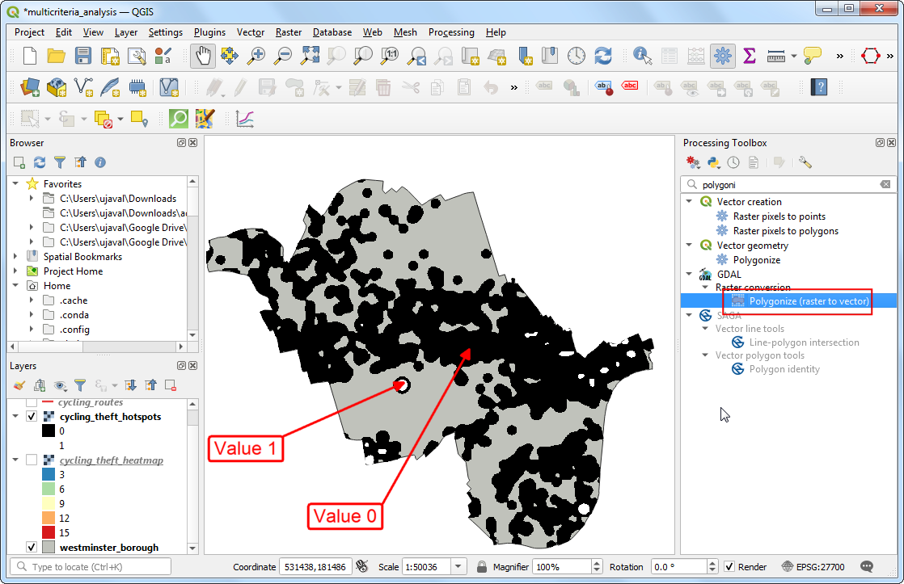

\newpage

\tableofcontents

\pagenumbering{arabic} 

\newpage

## Exercise Overview

Multi-criteria overlay analysis is the process of the selecting areas on the basis of a variety of location attributes. We will apply geoprocessing techniques on multiple vector layers and find areas to build new parking facilities that can help reduce bicycle thefts. We will apply the following 3 criteria:

1. The proposed area must be in a bicycle theft hotspot
2. The proposed area must be within 50meters from a bicycle route
3. The proposed area must NOT be within 50 meters from an existing bicycle parking facility.

We will carry out this analysis using bicycle infrastructure data for Westminster borough, London city.

### Exercise Outputs

- A polygon layer that shows areas that meet the criteria defined for a new bicycle parking facility.

### Datasets

- Cycle Routes and Parking facilities: Shapefiles for the Westminster borough, London. Provided by Transport for London. Available as `cycle_parking.shp` and `cycling_routes.shp` in your data package.
- Cycling Thefts Heatmap: Generated from Bicycle Theft Point locations for 2019 provided by data.police.uk. Available as `cycling_theft_heatmap.tif` in your data package.
- Westminster boundary: Extracted from London Boroughs layer from Statistical GIS Boundary Files for London. Available as `westminster_borough.shp`.

Download the data package file `infrastructure_multicriteria.zip` and unzip it to a directory on your computer. It is recommended to create a common data folder for this course and keep the materials there. You can unzip them to `<home directory>/Downloads/urban_planning/`

\newpage

### Software and Plugins

This exercise uses QGIS v3.16 or above.

## Extracting Hotspot Polygons

In the first part of the lab, we will learn how to extract the crime hotspots as a vector layer. We need th hotspots as a vector layer to be used in the multicriteria analysis.

1 Open QGIS.  Use the QGIS Browser Panel to locate the data package directory `infrastructure_multicriteria`. The folder comes with a QGIS project that contains pre-styled layers. Locate the `multicriteria_analysis` project and double-click to open it.

```{r echo=FALSE, fig.align='center', out.width='75%'}
knitr::include_graphics('images/infrastructure_hotspot1.png')
```

2. Turn off the vector layers for now. Select the `cycling_theft_heatmap` raster layer. Open Processing Toolbox and locate the *Raster analysis &rarr; Raster calculator* tool. Double-click to open it.

```{r echo=FALSE, fig.align='center', out.width='75%'}

```

3. We will define hotspots as all area with >= 4 times average crime. The mean pixel value in the heatmap is 3, so enter the following expression to extract all the hotspot pixels.

```
"cycling_theft_heatmap@1" >= 12
```

```{r echo=FALSE, fig.align='center', out.width='75%'}

```

4. Click the *...* button for *Reference layer(s)* and select `cycling_theft_heatmap`. Save the *Output* as `cycling_theft_hotspots.tif`. Click *Run*

```{r echo=FALSE, fig.align='center', out.width='75%'}

```

5. Once the processing finishes, a new raster layer `cycling_theft_hotspots` will be added. This raster contains pixel value 1 for the pixels where the expression was True and 0 where it was False. We can now convert this raster to a vector layer. Vectorization is the process of converting continuous blocks of same value pixels into polygons. Open the *Processing Toolbox* and locate the *GDAL &rarr; Raster conversion &rarr; Polygonize (raster to vector)*. Double-click to open it.

```{r echo=FALSE, fig.align='center', out.width='75%'}

```

6. Select `cycling_theft_hotspots` as the *Input layer*. Leave other options to default values and enter the *Vectorized* output name as `cycling_theft_hotspots_vectorized.shp`. Click *Run*.

```{r echo=FALSE, fig.align='center', out.width='75%'}

```

7. The resulting `cycling_theft_hotspots_vectorized` layer is a vector polygon layer. Open the attribute table. You will see that each feature contains an attribute for *DN* column with values `0` or `1`. All the hotspot pixels had value of `1` - so the polygons with that value represents the hotspots areas. Let's extract it to a separate layer. Locate the *Vector selection &rarr; Extract by attribute* and double-click to open it.

```{r echo=FALSE, fig.align='center', out.width='75%'}

```

8. Select `cycling_theft_hotspots_vectorized` layer as *Input layer*. Enter `1` as *Value*. Name the output layer as `cycling_theft_hotspots.shp`. Click *Run*.

```{r echo=FALSE, fig.align='center', out.width='75%'}
knitr::include_graphics('images/infrastructure_hotspot8.png')
```

9. Once the new layer is loaded, turn off other layers. You will see the hotspots are now extracted as polygons. We will use this layer in the next part of our analysis.

```{r echo=FALSE, fig.align='center', out.width='75%'}

```


\newpage

## Multicriteria Overlay Analysis

1. We are now ready to start analyzing the data and apply the criteria to search for potential locations. You may remove all other layers from QGIS except `westminster_borough`, `cycling_routes`, `cycling_theft_hotpsots` and `cycle_parking`.

```{r echo=FALSE, fig.align='center', out.width='75%'}

```

2. To visually be able to see the result of each step of our analysis, you can zoom in further near any of the hotspots. Since 2 of our criteria require us to find a location that is 'within' or 'not within'  certain distance, we can buffer the layers and use those layers. Go to *Processing Toolsbox* and locate the *Vector Geometry &rarr; Buffer* tool. Double-click to open it.

```{r echo=FALSE, fig.align='center', out.width='75%'}

```

3. Select `cycling_routes` as the *Input layer* and `50` `meters` as the *Distance*. Enter `cycling_routes_buffer.shp` as the *Buffered* output file. Click *Run*.

```{r echo=FALSE, fig.align='center', out.width='75%'}

```

4. The new layer `cycling_routes_buffer` will be a polygon layer showing all areas within 50 meters of bicycle routes. Run the *Buffer* tool again.

```{r echo=FALSE, fig.align='center', out.width='75%'}

```

5. Select `cycle_parking` as the *Input layer* and `50` `meters` as the *Distance*. Enter `cycle_parking_buffer.shp` as the *Buffered* output file. Click *Run*.

```{r echo=FALSE, fig.align='center', out.width='75%'}

```

6. The new layer `cycle_parking_buffer` will be a polygon layer showing all areas within 50 meters of bicycle parking location. Now we can use geoprocessing operations on the layers to sequentially apply our criteria. First, we will find all areas that are both in a hotspot and is within 50 meters of a bicycle route. Search and locate the *Vector overlay &rarr; Intersection* tool.  Double-click to open it.

```{r echo=FALSE, fig.align='center', out.width='75%'}

```

7. Select `cycling_theft_hotpsots` as the *Input layer* and `cycling_routes_buffer` as the *Overlay layer*. Enter the *Intersection* output name as `hotspot_and_route_buffer.shp`. Click *Run*.

```{r echo=FALSE, fig.align='center', out.width='75%'}

```

8. The new layer will have the regions that meet 2 of our criteria. Now time to apply the third criterion. We will use the *Vector overlay &rarr; Difference* tool. Click *Run*.

```{r echo=FALSE, fig.align='center', out.width='75%'}

```

9. Select `hotspot_and_route_buffer` as the *Input layer* and `cycle_parking_buffer` as the *Overlay layer*. Name the output *Difference* layer as `results.shp`. Click *Run*.

```{r echo=FALSE, fig.align='center', out.width='75%'}

```

10. The `results` layer polygons are the areas in the borough that meet the 3 criteria that we had set out.

```{r echo=FALSE, fig.align='center', out.width='75%'}

```

11. Any location within these polygons will be ideal for a new bicycle parking facility.

```{r echo=FALSE, fig.align='center', out.width='75%'}

```


\newpage


## Data Credits

- Cycling Infrastructure data: Public Tfl data.  Downloaded from https://cycling.data.tfl.gov.uk/ . Contains OS data © Crown copyright and database rights 2016 and Geomni UK Map data © and database rights [2019]
- London Individual crime and anti-social behavior (ASB) incidents, including street-level location information and subsequent police and court outcomes associated with the crime. Published by Single Online Home National Digital Team under Open Government Licence v3.0. Downloaded from https://data.police.uk/
- Statistical GIS Boundary Files for London: Downloaded from https://data.london.gov.uk/. Contains National Statistics data © Crown copyright and database right [2015], Contains Ordnance Survey data © Crown copyright and database right [2015]

***