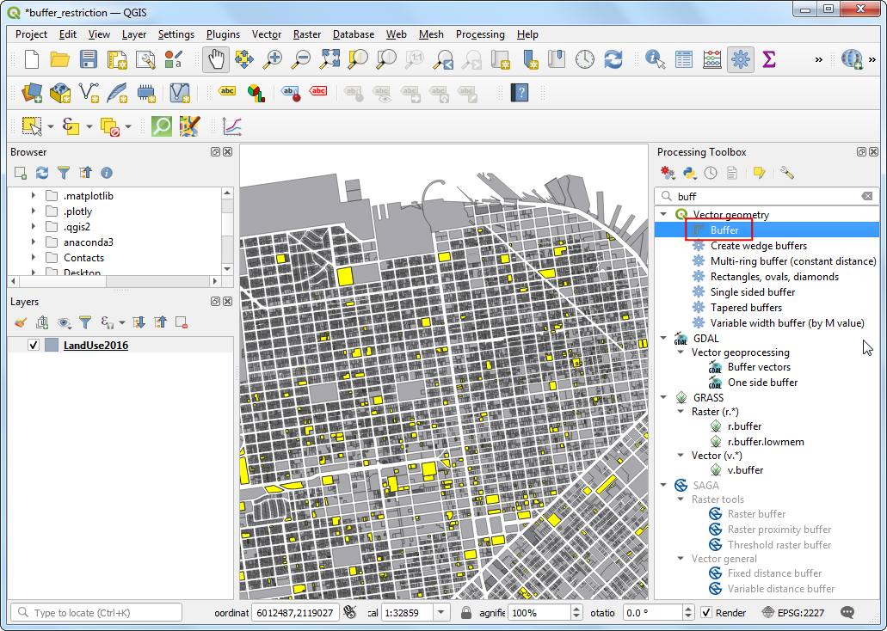

\newpage

\tableofcontents

\pagenumbering{arabic} 

\newpage

## Exercise Overview

In this exercise we will work with Landuse data for a city and determine buffer zones around a particular land use. The data comes from City of San Francisco in form of parcels polygons with attribute indicating the Land use categories. We will use geoprocessing and spatial analysis techniques to determine a buffer of restricted area around all properties with institutional land use. Such analysis is required to establish a corridor of restrictions around noise pollution or heavy traffic.

### Exercise Outputs

* A polygon layer representing the restricted corridor
* Updated parcels layer with a column indicating whether a usage restriction applies to the particular feature.

### Datasets

* *Land use database*: A polygon shapefile with land use categories for every parcel in San Francisco. Shapefiles are available as `LandUse2016.shp` in your data package.

Download the data package file `landuse_buffer.zip` and unzip it to a directory on your computer. It is recommended to create a common data folder for this course and keep the materials there. You can unzip them to `<home directory>/Downloads/urban_planning/`

### Software and Plugins

This exercise uses QGIS v3.14 or above.

\newpage

## Identifying Institutional Land use Parcels

1. Open QGIS. Use the QGIS Browser Panel to locate the data package directory. Double-click the `buffer_restriction.qgz` project to load the project. This will load the `Landuse2016` layer which has polygons for every land parcel in the city of San Francisco. 

```{r echo=FALSE, fig.align='center', out.width='75%'}

```

2. Select the `Landuse2016` layer and click the *Open Attribute Table* button from the *Attributes Toolbar*. Explore the attributes for each parcel. The column **LANDUSE** contains the land use categories for the parcels. 

```{r echo=FALSE, fig.align='center', out.width='75%'}

```

3. The shapefile also comes with a *Metadata* document explaining the meaning of each category. Browse to the data package directory and open the `Land_Use_Metadta.docx` document. As outlined in the document, the land use classification for the city is as follows:

| Attribute Value | Land Use Category |
| ----| --------------------------------------|
|	CIE | Cultural, Institutional, Educational |
|	MED | Medical |
|	MIPS | Office (Management, Information, Professional Services) |
|	MIXED | Mixed Uses (Without Residential) |
|	MIXRES | Mixed Uses (With Residential) |
|	PDR | Industrial (Production, Distribution, Repair) |
|	RETAIL/ENT | Retail, Entertainment |
|	RESIDENT | Residential |
|	VISITOR | Hotels, Visitor Services |
|	VACANT | Vacant |
|	ROW | Right-of-Way |
|	OPENSPACE | Open Space |

```{r echo=FALSE, fig.align='center', out.width='75%'}

```

4. For this exercise, we are interested in the Institutional land use. So we can query for the value **CIE** in the attribute table. Go to Processing &rarr; Toolbox.

```{r echo=FALSE, fig.align='center', out.width='75%'}
knitr::include_graphics('images/buffer_identify4.png')
```

5. Search and locate the *Vector Geometry &rarr; Select by Attribute* tool from the toolbox. Double-click to open it.

```{r echo=FALSE, fig.align='center', out.width='75%'}

```

6. In the *Select by Attribute* dialog, set `Landuse2016` as the *Input layer*. Select `LANDUSE` as the *Selection attribute* and enter `CIE` as the *Value*. Click *Run*.

```{r echo=FALSE, fig.align='center', out.width='75%'}

```

7. You will see the parcels matching our query will be highlighted in yellow. These are all parcels belonging to the institutional land use in the city.

```{r echo=FALSE, fig.align='center', out.width='75%'}

```

## Creating Buffers

1. Now we can create a buffer around the selected parcels. Before that, notice the CRS name at the bottom-right corner of QGIS. It indicates that the data is in the projected CRS `EPSG:2227`. Click on it.

```{r echo=FALSE, fig.align='center', out.width='75%'}

```

2. The *Project Coordinate Reference System (CRS)* dialog will show the selected CRS is `NAD83 / California zone 3 (ftUS)`. The data layer's coordinate system uses the NAD83 datum with measurement units in **feet**. Do make a note of this. All geoprocessing on this layer will be done in the native units of the CRS. Close the dialog.

```{r echo=FALSE, fig.align='center', out.width='75%'}

```

3. Back in the main QGIS window, open Processing Toolbox. Search and locate the *Vector Geometry &rarr; Buffer* tool. Double-click to open it.

```{r echo=FALSE, fig.align='center', out.width='75%'}

```

4. In the *Buffer* dialog, select `Landuse2016` as the *Input layer*. Check the *Selected features only* box so the buffer will apply only to the selected institutional land use parcels. We will create a buffer zone of 100ft around each parcel. Enter `100` `feet` as the *Distance*. The default buffers are of circular shape. Since we are dealing with parcel data, a rectangular buffer area is more appropriate where each edge of the parcel will be offset by the buffer distance. Select `Square` as the *End cap style* and `Miter` as the `Join style`. Click the *...* button next to *Buffered* and select *Save to File..*.

```{r echo=FALSE, fig.align='center', out.width='75%'}

```

5. Enter the output file name as `buffer.shp` and click *OK*. Click *Run*.

```{r echo=FALSE, fig.align='center', out.width='75%'}

```

6. Once the processing finishes, a new layer `buffer` will be added to QGIS. These polygons represent the buffer zone of restrictions around the institutional land use.

```{r echo=FALSE, fig.align='center', out.width='75%'}

```

## Adding restricted column to parcels layer

1. We now know which areas of the city fall under the restricted zone. It would be useful to identify all parcels which fall in this zone and add an attribute indicating that a restriction applies to that parcel. Let's first add a column to the buffer polygons. Select the `buffer` layer and search for *Vector Table &rarr; Field Calculator* tool in the Processing Toolbox. Double-click to open it.

```{r echo=FALSE, fig.align='center', out.width='75%'}

```

2. In the *Field Calculator* dialog, ensure `buffer` is selects as the *Input layer*. We don't need to save this layer, so leave the *Output file* field empty. Enter `RESTRICTED` as the *Output field name*. Set the *Output field type* to `String`. Type `'Yes'` as the *Expression*.  Click *OK*.

```{r echo=FALSE, fig.align='center', out.width='75%'}

```

3. A new layer called `Calculated` will be added to QGIS. Open the Attribute Table and verify that a new column called *RESTRICTED* with value `Yes` exists in this layer. 

```{r echo=FALSE, fig.align='center', out.width='75%'}

```

4. Now we can do a *Spatial Join* to add this attribute to the original parcels layer based on which parcels intersect with the buffer zone. Search and locate the *Vector Analysis &rarr; Join attributes by location* tool. Double-click to open it.

```{r echo=FALSE, fig.align='center', out.width='75%'}

```

5. Select `LandUse2016` as the *Base Layer* and `Calculated` as the *Join Layer*. Click *...* next to *Fields to add*.

```{r echo=FALSE, fig.align='center', out.width='75%'}

```

6. Select only the `RESTRICTED` field and click *OK*.

```{r echo=FALSE, fig.align='center', out.width='75%'}

```

7. For *Join Type*, select `Take attribute of the first matching feature only`. Next, click *...* next to *Joined layer* and select *Save to File*.

```{r echo=FALSE, fig.align='center', out.width='75%'}

```

8. Enter the output file as `LandUseWithRestrictions.shp` and click *OK*. Click *Run*.

```{r echo=FALSE, fig.align='center', out.width='75%'}

```

9. Once the processing finishes, you will get a new layer `LandUseWithRestrictions`. Open the *Attribute Table* and examine the *RESTRICTED* column. The parcels that fall within 100ft of an institutional parcel now have the value `Yes` indicating a restriction applies to that parcel. Other parcels have a `NULL` value indicating no restriction.

```{r echo=FALSE, fig.align='center', out.width='75%'}

```

\newpage

## Discussion

There are various applications of buffer analysis which are useful for land use management.

- In this exercise we have taken an example of institutional buildings that can in form of government offices, academic institutions, schools, or health complexes/ medical care units etc. Many times, cities impose restrictions or would like to impose restrictions around such buildings/ zones in terms of no honking zone, reduced/ restricted traffic, security and surveillance zones and among others. Through buffer applications, the city can delineate such areas and decide upon the zones which has high prevalence of such buildings to identify the cluster of zones and so on. 
- In terms of schools, may be the area is required to be restricted for establishing/ sale of tobacco/ liquor vendors, or deciding on the corridor for reduced vehicular speed and so on.
- Similarly, the other application areas can be in terms of restricting the zone for any new development around any heritage buildings, or identifying the development zones by identifying dilapidated cluster of buildings.

Think about the other numerous applications that can be implemented by linking the physical assets and its purpose in terms of service delivery, development or revenue mobilization. 

## Data Credits

* Land use shapefile is provided by [DataSF Open Data Portal](https://data.sfgov.org/). 
***