\newpage

\tableofcontents

\pagenumbering{arabic} 

\newpage

## Exercise Overview

Land-Cover data is a crucial reference dataset that informs a wide variety of strategic planning activities. Land Cover data is often generated from satellite/aerial imagery and is available in the raster format. In this exercise, we will work with the [South African National Land-Cover (SANLC)](https://www.environment.gov.za/projectsprogrammes/egis_landcover_datasets) datasets. 

The SANLC dataset is available in 3 epochs: 1990 <-> 2014 <-> 2018, that allows for quantification of landscape change over a 25 year period to be determined both spatially and informatively. In this exercise, we will work on 2 spatial analysis tasks:

1. Use *The South African National Land Cover 2018 dataset* to identify areas under informal settlements in Gauteng province.
2. Analyze the *Landcover Change 2014-18* dataset to identify urban growth pattern around the City of Johannesburg.

### Exercise Outputs
- Map showing areas under informal settlements in the Gauteng province.
- Map showing growth pattern of built-up areas around City of Johannesburg.

### Datasets


- [The South African National Land Cover 2018 (SANLC)](https://www.environment.gov.za/projectsprogrammes/egis_landcover_datasets): A GeoTIFF file clipped to the Gauteng region. File is available as `SA_NLC_2018_Gauteng.tif` in your data package. 
- *Land Cover Change 2014-18*: A  GeoTIFF file with change codes indicating land use transitions from 2014-2018, clipped to the Gauteng region. File is available as `SA_NLC_2014_2018_CHANGE_Gauteng.tif` in your data package.
- City of Johannesburg Boundary: A polygon shapefile indicating the city administrative boundary for Johannesburg. Available as `COJ_Boundary.shp` in your data package.

Download the data package file `landuse_change.zip` and unzip it to a directory on your computer. It is recommended to create a common data folder for this course and keep the materials there. You can unzip them to `<home directory>Downloads/urban_planning/`

### Software and Plugins

This exercise uses QGIS v3.14 or above.

We will also use the **QuickMapServices** plugin. Plugins can be installed from QGIS from **Plugins &rarr; Manage and Install Plugins..**. To install a plugin, switch to the *All* tab and search for the plugin name. Once you find it, select and click *Install Plugin*.

\newpage

## Identifying Informal Settlements

1. Open QGIS.  Use the QGIS Browser Panel to locate the data package directory `landuse_change`. Drag the `SA_NLC_2018_Gauteng.tif` file to the canvas.

```{r echo=FALSE, fig.align='center', out.width='75%'}
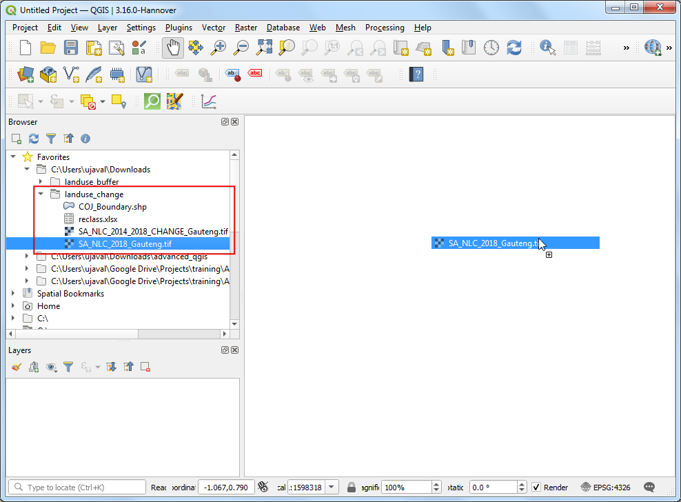
```

2. A new layer `SA_NLC_2018_Gauteng` will be added to QGIS. This is a raster image of land cover. Use the *Identify* tool in the *Attributes Toolbar* to click on the image and inspect the pixel values. You will see that the pixel values range from 1 to 73. These values represent a distinct land use/land cover class.

```{r echo=FALSE, fig.align='center', out.width='75%'}
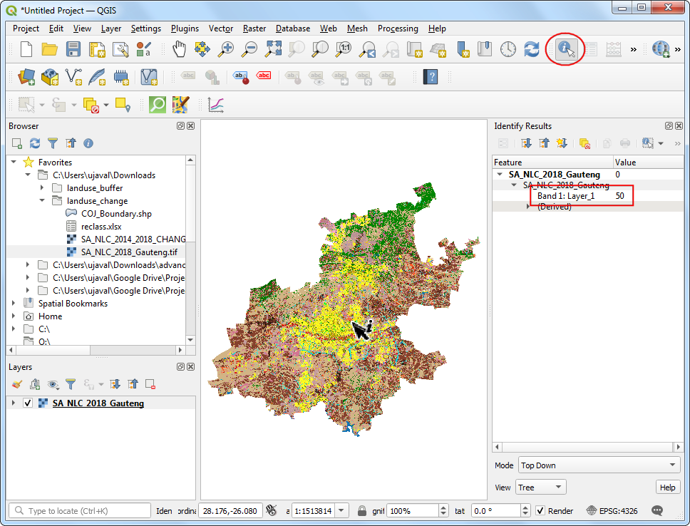
```

3. The dataset is accompanied by the *SANLC 2018 Launch Presentation* which describes these classes in detail. For this exercise, we are interested in the *informal settlements* which are represented by class numbers 51 through 54.

```{r echo=FALSE, fig.align='center', out.width='75%'}
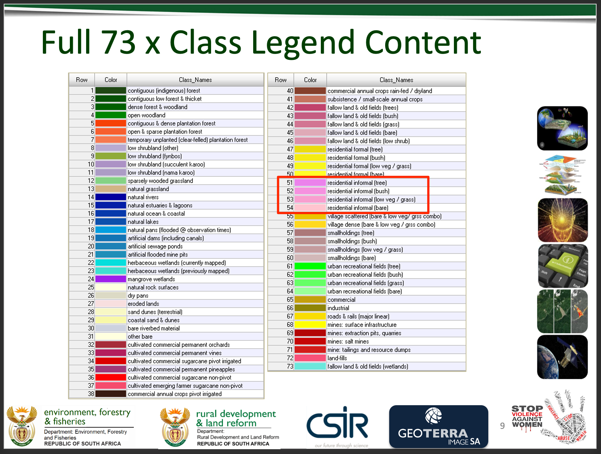
```

4. Let's extract pixels belonging to these classes. Go to *Processing &rarr; Toolbox* and search for the *Raster calculator* tool. Double-click to open it.

```{r echo=FALSE, fig.align='center', out.width='75%'}
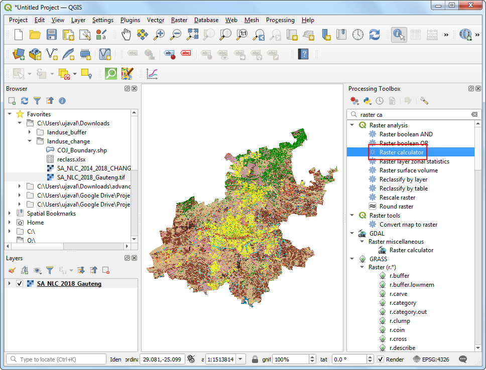
```

5. The source image has only 1 band. The `@1` suffix indicates the band number. Enter the following expression to select pixels from class 51-54. 

```
"SA_NLC_2018_Gauteng@1" >= 51 AND "SA_NLC_2018_Gauteng@1" <= 54
```

```{r echo=FALSE, fig.align='center', out.width='75%'}
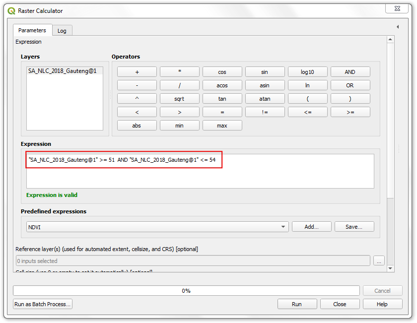
```

6. Scroll down and click the *...* button next to *Reference layer(s)*. Select the `SA_NLC_2018_Gauteng` layer and click *OK*.

```{r echo=FALSE, fig.align='center', out.width='75%'}
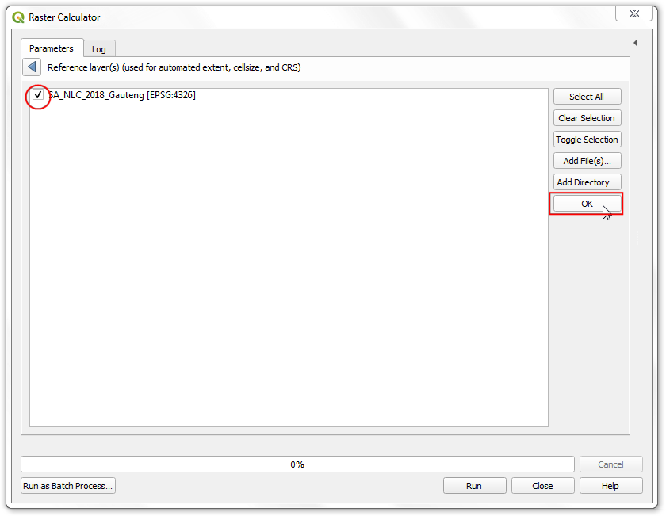
```

7. Next, click the *...* button next to *Output* and select *Save to File...*.

```{r echo=FALSE, fig.align='center', out.width='75%'}
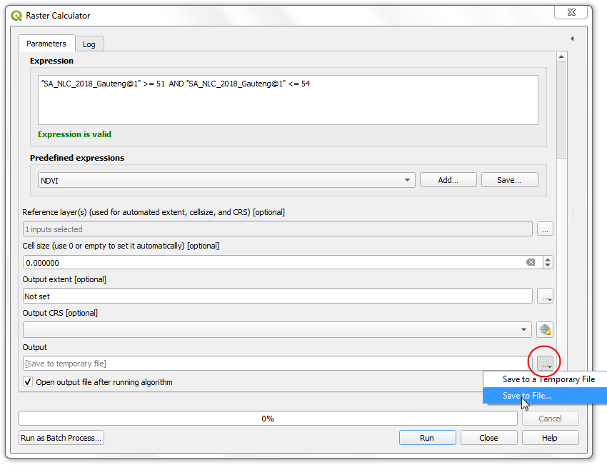
```

8. Name the output file `residential_informal.tif` and click *Run*.

```{r echo=FALSE, fig.align='center', out.width='75%'}
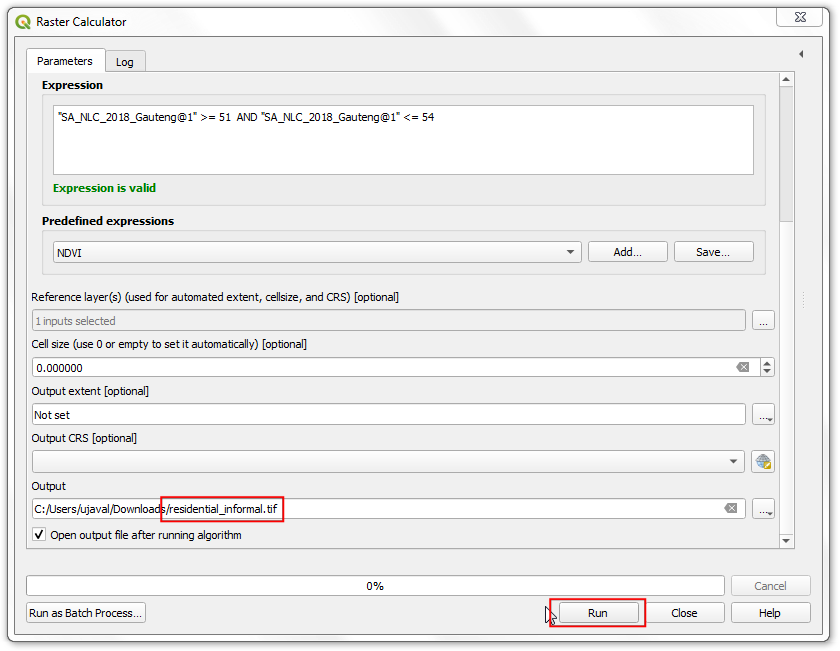
```

9. Once the processing finishes, a new layer `residential_informal` will be added to QGIS. This raster layer has only 2 pixel values - `1` where our expression evaluated to true and `0` where it was false. The pixels that appear white are the ones belonging to the informal settlement classes.

```{r echo=FALSE, fig.align='center', out.width='75%'}
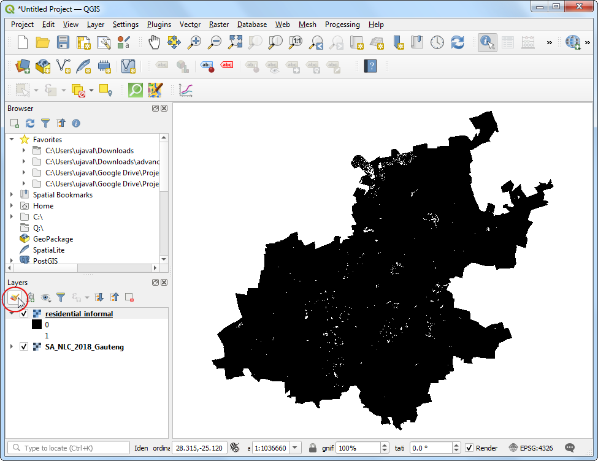
```

10. We will now style this layer better so we can see the informal settlements clearly. Turn off the `SA_NLC_2018_Gauteng` layer from the *Layers* panel. Select the `residential_informal` layer and click the *Open the layer styling panel* button. Change the renderer to be *Paletted/Unique values*.

```{r echo=FALSE, fig.align='center', out.width='75%'}
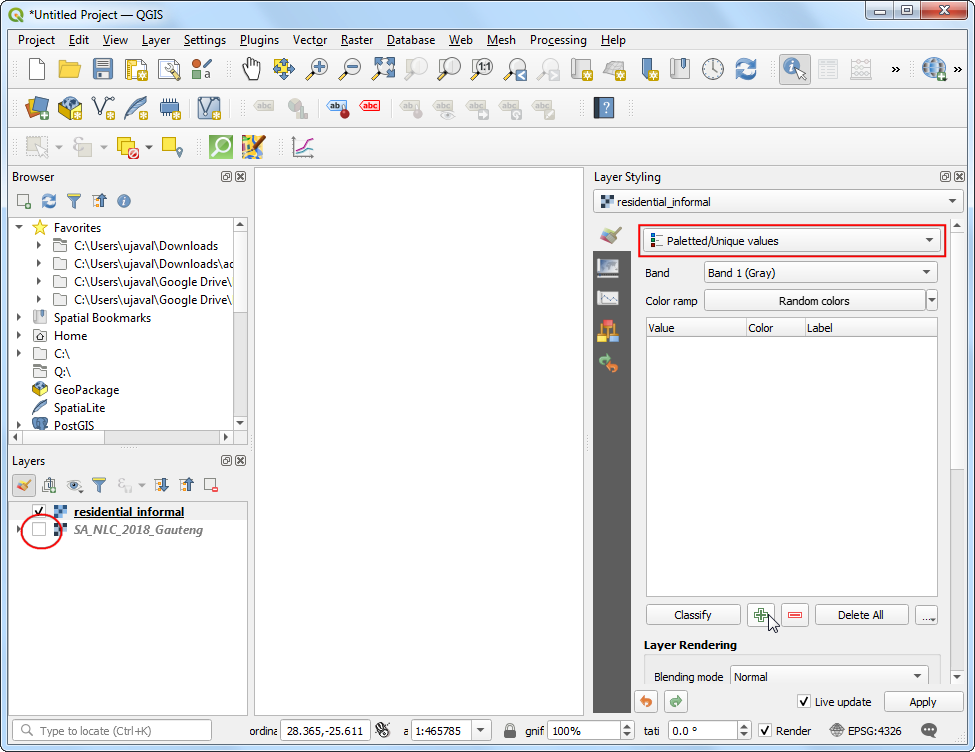
```

11. Click the *+* button. Change the *Value* to `1` and enter `Residential Informal` as *Label*. Select a color of your choice.

```{r echo=FALSE, fig.align='center', out.width='75%'}
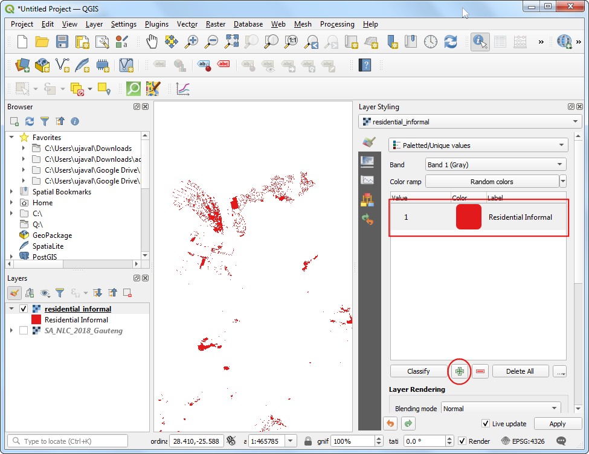
```

12. We can now see all the informal settlement in the Gauteng region. It would be helpful to see them in context with a basemap. We have access to a variety of base-maps from the *QuickMapServices* plugin. Once you install the plugin, go to *Web &rarr; QuickMapServices &rarr; OSM &rarr; OSM Standard* to add the OpenStreetMap layer.

```{r echo=FALSE, fig.align='center', out.width='75%'}
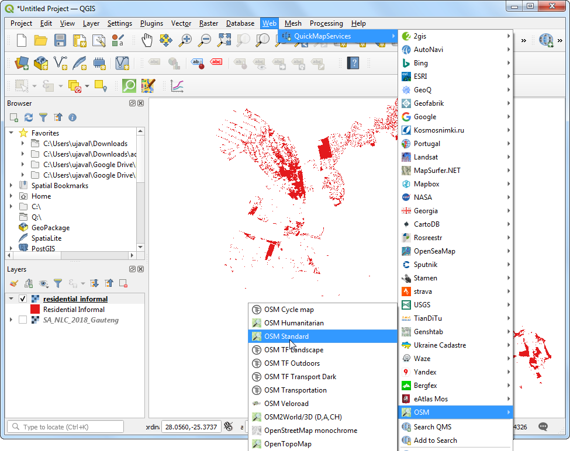
```

13. Now you can easily identify and verify whether our analysis correctly identified the informal settlements. You can select the `residential_informal` layer and switch to the *Transparency* tab in the *Layer styling panel*. You can reduce the *Global Opacity* to see both the extracted pixels and the basemap together.

```{r echo=FALSE, fig.align='center', out.width='75%'}
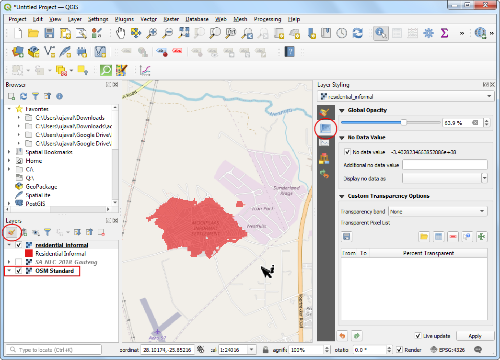
```

\newpage

## Identifying Urban Growth Pattern

1. We learnt how to extract specific pixel values from a raster dataset. Now we will work with another raster dataset and learn a different technique to extract pixel value ranges for different classes. The task is to identify all the areas where the land cover changed to built-up area from 2014 to 2018. This will allow us to see the urban growth pattern. Drag the `SA_NLC_2014_2018_CHANGE_Gauteng.tif` file from the *Browser* to the canvas. 

```{r echo=FALSE, fig.align='center', out.width='75%'}
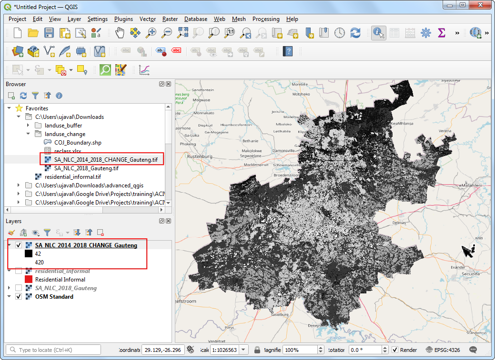
```

2.  Use the *Identify* tool in the *Attributes Toolbar* to click on the image and inspect the pixel values. You will see that the pixel values range from 21-420. Each value indicates transition from one of the 73 source classes to another class.

```{r echo=FALSE, fig.align='center', out.width='75%'}
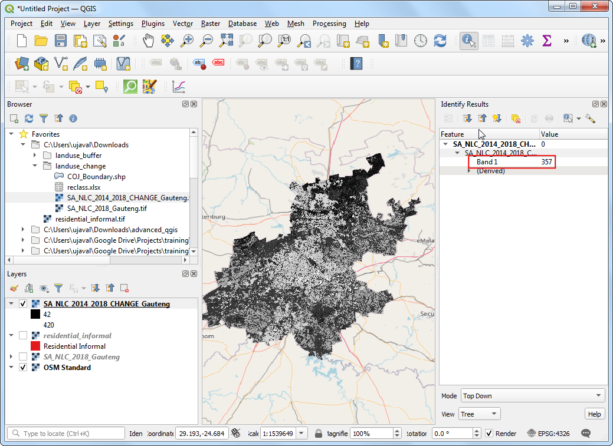
```

3. The *SANLC 2018 Change Assessment Report* comes with a spreadsheet named `20_class_change_matrix_codes_final_1990-2014-2018_vs1.xlsx`. This sheet has the matrix that gives more details about each pixel value. We are interested in all pixel values where any source class changed into a destination built-up class. In the image below, these are highlighted in blue.

```{r echo=FALSE, fig.align='center', out.width='75%'}
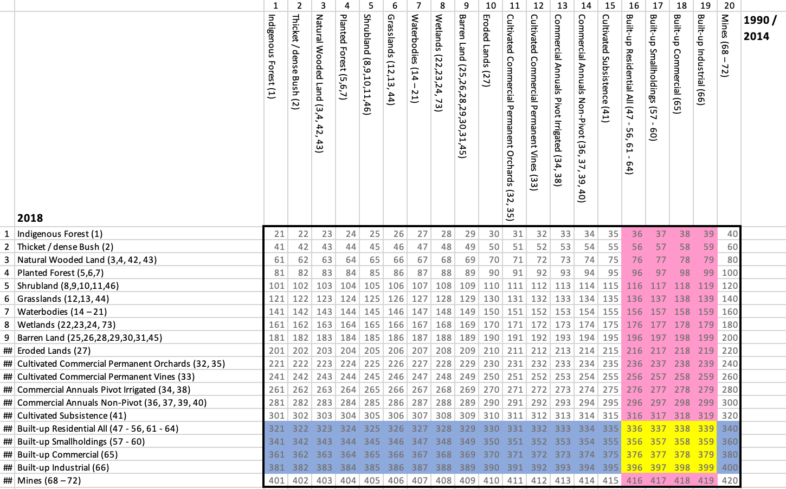
```

4. We will now apply a reclassification algorithm that will transform the source pixel values into a new destination value. All values which indicate built-up class which remained built-up will be mapped to `1`. All values which indicate transition from non built-up to built-up will be mapped to `2`. All remaining values will be mapped to `0`. This information is encoded in the supplied `reclas.xlsx` file. QGIS can read Excel files directly, so drag and drop that layer to QGIS canvas.

```{r echo=FALSE, fig.align='center', out.width='75%'}
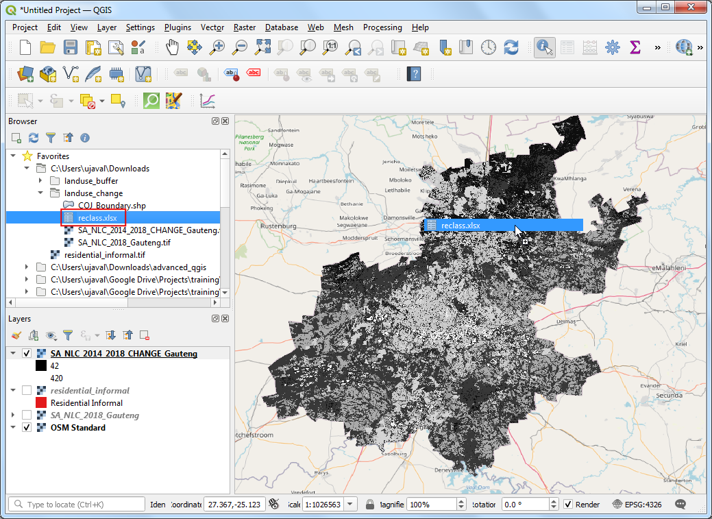
```

5. A new layer `reclass Sheet1` will be added to the *Layers* panel. Select it and open the *Attribute Table*. The expected format for this file is 3 columns. `MIN` and `MAX` columns with range of input values and `OUTPUT` column with target values. Open the *Processing Toolbox* and search for the *Reclassify by layer* tool.

```{r echo=FALSE, fig.align='center', out.width='75%'}
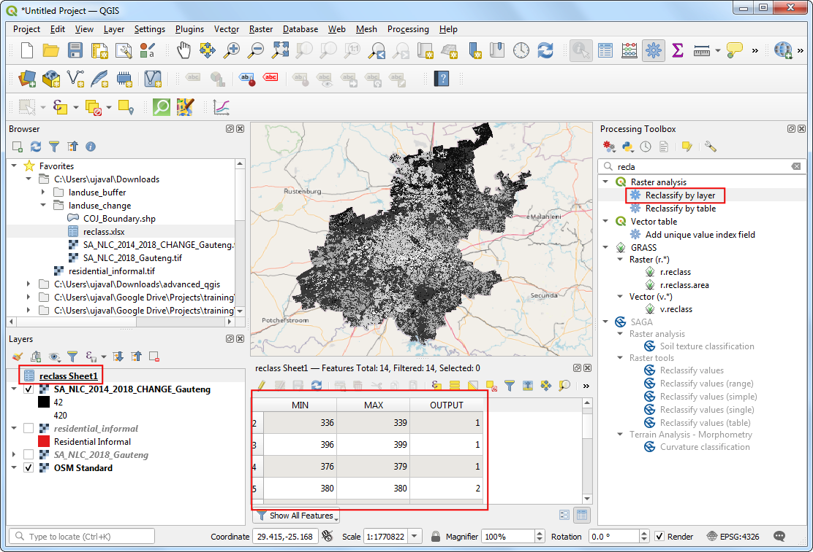
```

6. In the *Reclassify by layer* dialog, select `SA_NLC_2014_2018_CHANGE_Gauteng` as the *Raster layer*. Select `reclass Sheet1` as the *Layer containing class breaks*. Select `MIN`, `MAX` and `OUTPUT` fields for their respective fields.

```{r echo=FALSE, fig.align='center', out.width='75%'}
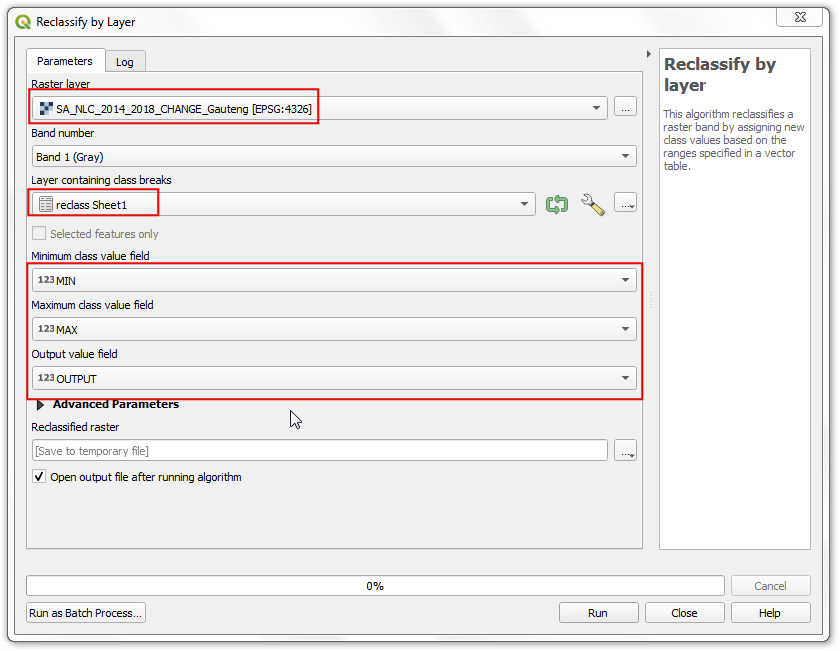
```

7. Expand the *Advanced Parameters* section. Change the *Range boundaries* to `min <= value <= max`. Click the *...* button for *Reclassified raster* and enter the output file name as `builtup_change.tif`. Click *Run*.

```{r echo=FALSE, fig.align='center', out.width='75%'}
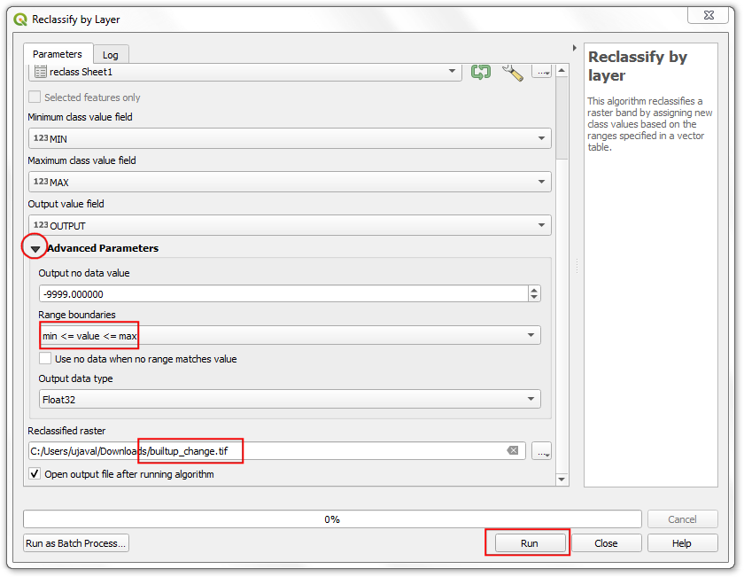
```

8. Once the processing finishes, a new layer `builtup_change` with pixel values 0-2 will be added to the canvas. 

```{r echo=FALSE, fig.align='center', out.width='75%'}
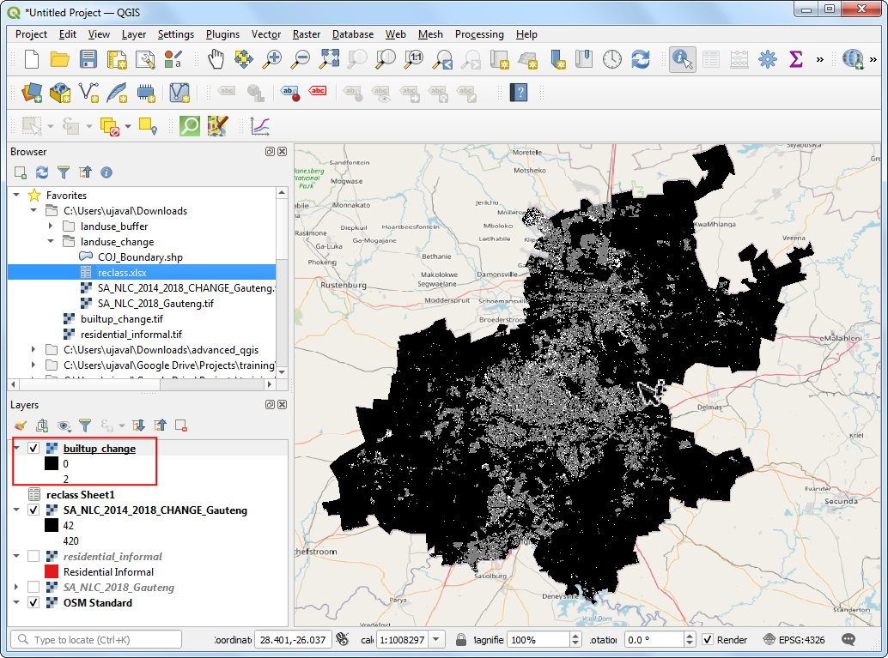
```

9. Open the *Layer styling panel* and click the *+* button to add 3 categories: `Non Built-up`, `Existing Built-up` and `New Built-up` for pixel values `0`, `1` and `2` respectively.

```{r echo=FALSE, fig.align='center', out.width='75%'}
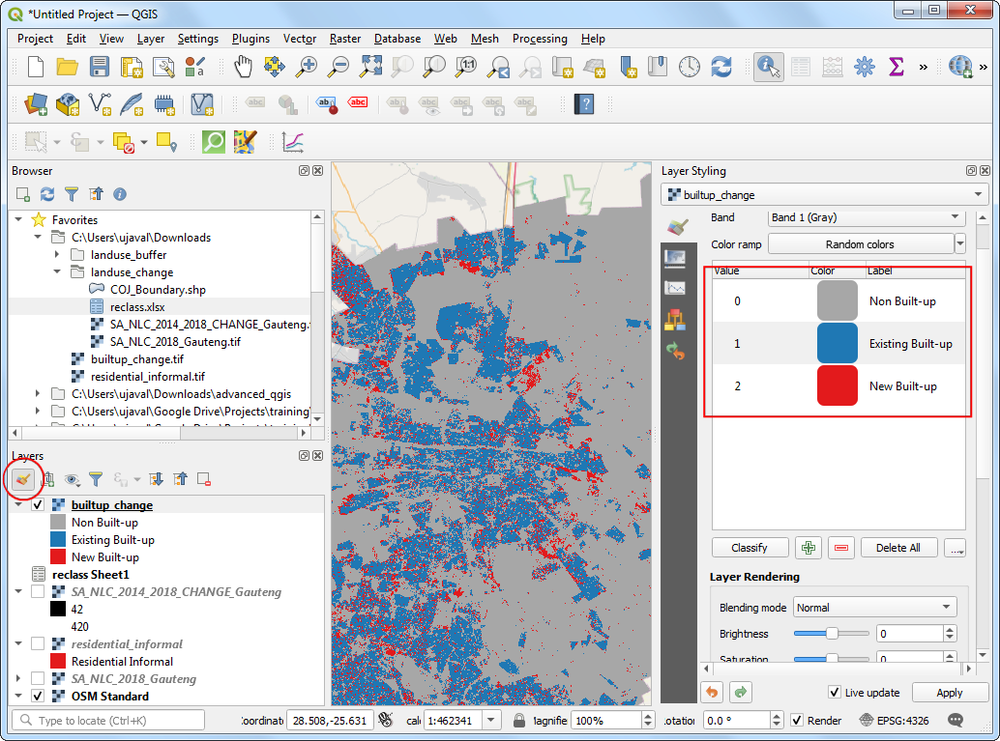
```

10. It would be helpful to see the growth in context of the city boundary. Locate the `COJ_Boundary.shp` file and drag it to the canvas.

```{r echo=FALSE, fig.align='center', out.width='75%'}
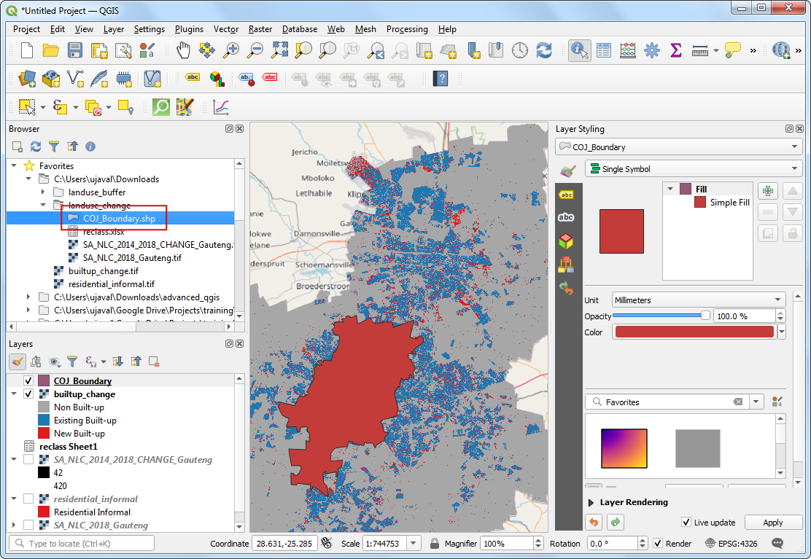
```

11. Change the sub-renderer from *Simple Fill* to *Simple Line* and increase the line width. You can now see the city boundary overlaid on the raster layer.

```{r echo=FALSE, fig.align='center', out.width='75%'}
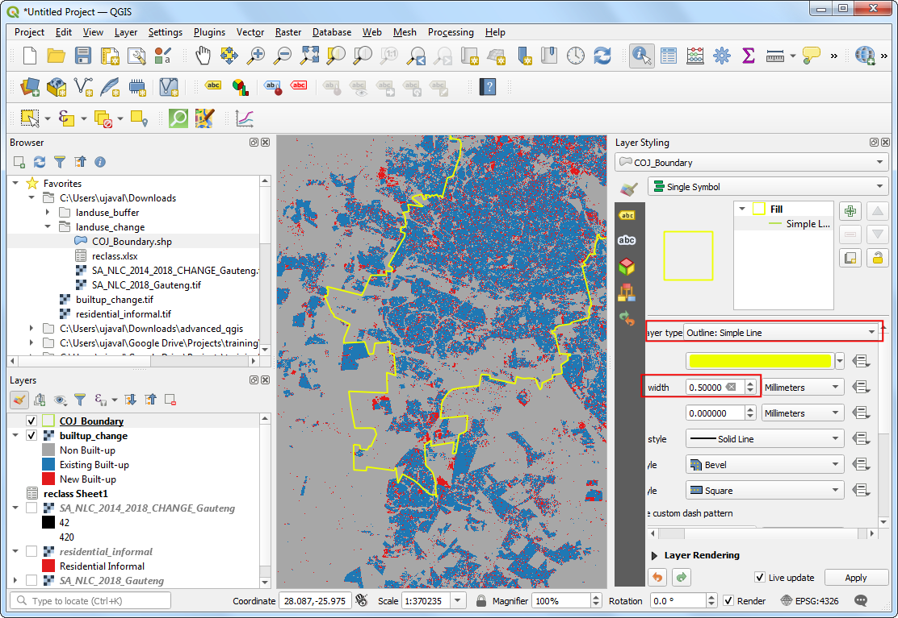
```

12. Explore the pattern of built-up area growth indicated by the red pixels.
 
```{r echo=FALSE, fig.align='center', out.width='75%'}
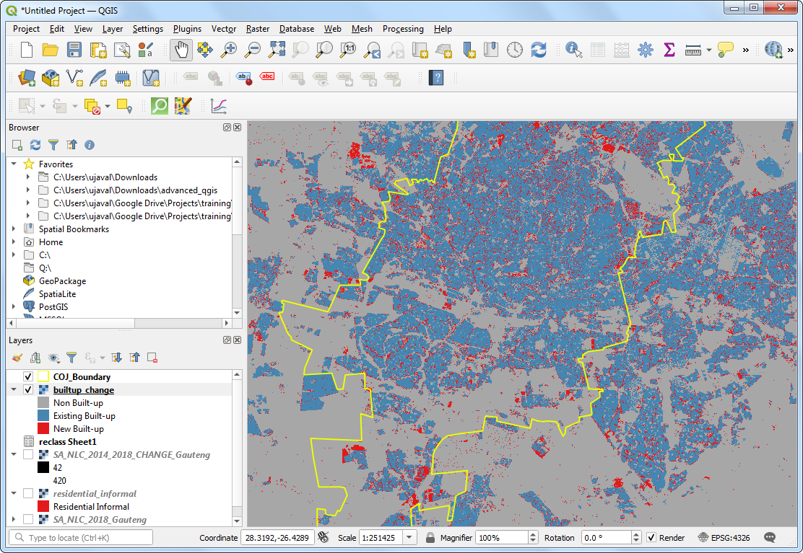
```

\newpage

## Discussion

- A comprehensive analysis can be done using the raster data. Using this example, think about the comparative analysis of the different regions/ wards at a city level which have high concentration of the informal settlements. What strategies would you use to intervene further using such analysis? How will rank the severity of such informal settlements within the city/ region? 
- You have seen an interesting exercise about the built-up area growth pattern for the City of Johannesburg. Think about the its impact on the development pattern and whether it is a positive development pattern or negative development pattern. When you over lay, the land use classification system, you will be able to delineate the type of developments which have come along such urban development boundaries and other areas as well. Think about the type of applications that the city can use such analysis for various scenario building and decision making process

## Data Credits

- The land cover datasets are provided by Department of Environment, Forestry and Fisheries, South Africa. Downloadeded from [E-GIS website](https://egis.environment.gov.za/data_egis/data_download/current)
- City of Johannesburg shapefile is provided by [COJ Spatial Development Framework 2040](https://www.joburg.org.za/documents_/Pages/Key%20Documents/policies/Development%20Planning%20%EF%BC%86%20Urban%20Management/Citywide%20Spatial%20Policies/Spatial-Development-Framework-2040.aspx). Downloaded from [SDF Shapefiles](http://bit.ly/joburg-sdf-16) database.

***