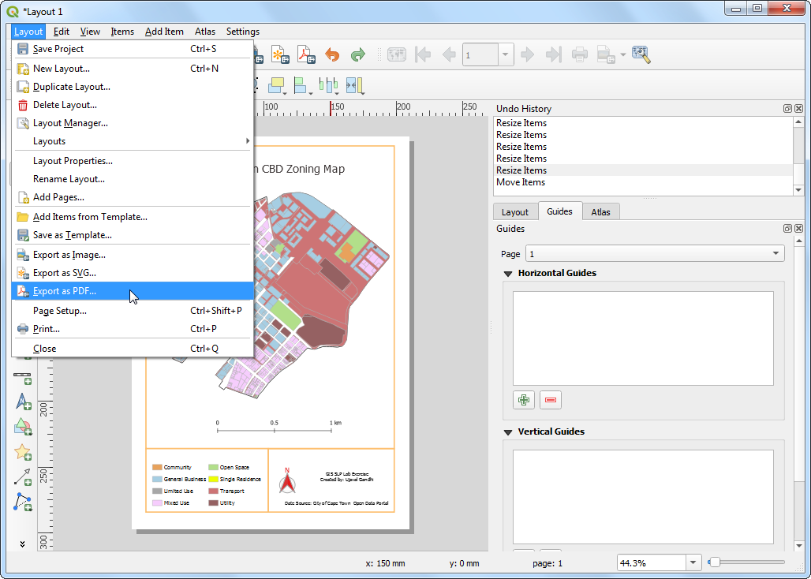

\newpage

\tableofcontents

\pagenumbering{arabic} 

\newpage

## Exercise Overview

Zoning designations define and regulate what kinds of uses are allowed on specific parcels and
outline design and development requirements and guidelines. In this exercise, we will work with a land parcels dataset with zoning information and create a map showing zoning pattern across the CBD region of Cape Town.

### Exercise Outputs

- A PDF map with parcels styled according to land use zones with clear legend and map elements.

```{r echo=FALSE, fig.align='center', out.width='75%'}

```

### Datasets

- Zoning layer: A polygon shapefile with zoning code and description for land parcels having a single zoning - clipped to the Cape Town CBD area. Available as `zoning_cbd.shp` on your data package.
- Split-zoning layer: A polygon shapefile with zoning code and description for land parcels having multiple zoning - with each polygon split into single zones polygons. Available as `split_zoning_cbd.shp`
- Cape Town CDB Area: A polygon demarcating the Cape Town CBD area. Available as `cbd.shp`.

Download the data package file `landuse_mapping.zip` and unzip it to a directory on your computer. It is recommended to create a common data folder for this course and keep the materials there. You can unzip them to `<home directory>/Downloads/urban_planning/`

### Software and Plugins

This exercise uses QGIS v3.14 or above.


\newpage

## Styling Vector Data Layers

1. Open QGIS. Use the QGIS Browser Panel to locate the data package directory. Drag the `cbd.shp` and `zoning_cbd.shp` files to the canvas.

```{r echo=FALSE, fig.align='center', out.width='75%'}

```

2. As we work on the exercise, it is important to save our work. Go to *Project &rarr; Save...*. Save the project to the data directory as `zoning_map.qgz` file. The QGIS Project file contains references to the data layers and saves styles, map templates etc. 

```{r echo=FALSE, fig.align='center', out.width='75%'}

```

3. Select the `zoning_cbd` layer and click the *Open Attribute Table* button in the *Attributes Toolbar*. Noe that the attribute `INT_ZONE_C` has the zoning codes and `INT_ZONE_D` has the zoning description. Close the attribute table.

```{r echo=FALSE, fig.align='center', out.width='75%'}

```

4. Now let's style the layer based on these attributes, so the parcels with the same zoning codes are styles in the same color. Click the *Open the Layer Styling panel* button in the *Layers* panel. Click the dropdown button next to *Single Symbol*.

```{r echo=FALSE, fig.align='center', out.width='75%'}

```

5. Select `Categorized` as the renderer. Select `INT_ZONE_C` as the *Value*. Click *Classify*.

```{r echo=FALSE, fig.align='center', out.width='75%'}

```

6. You will see a series of symbols appear. There is a different color symbol assigned for every unique code in the layer.

```{r echo=FALSE, fig.align='center', out.width='75%'}

```

7. Notice that each zoning category has sub-categories. The *General Business (GB)* category has further sub-divisions like *GB1*, *GB2*, and so on. For the purpose of this map, we can merge all the sub-categories to a single top-level category. Hold the *Shift* key and select all sub-categories. Right-click and select *Merge Categories*.

```{r echo=FALSE, fig.align='center', out.width='75%'}

```

8. Repeat the process for *MU* and *TR* categories. Once merged, we can now change the *Legend* label to be more descriptive. Click on the legend label for a class.

```{r echo=FALSE, fig.align='center', out.width='75%'}
knitr::include_graphics('images/zoning_styling8.png')
```

9. Enter descriptions of each zoning category based on the values given in the `INR_ZONE_D` column. As you enter those description, you will see the legend of the layer in the *Layers* panel also update.

```{r echo=FALSE, fig.align='center', out.width='75%'}

```

10. Now we can update the colors and symbology of each category. Click on the *Symbol* for a category.

```{r echo=FALSE, fig.align='center', out.width='75%'}

```

11. Change the *Fill color* and *Stroke color* of the symbol to a color of your choice.

```{r echo=FALSE, fig.align='center', out.width='75%'}

```

12. Repeat the process for each category. The last category is *all other values*. This category contains all parcels which have *NULL* values. This is because those parcels have multiple zoning categories attached to them and are represented in the `split_zoning_cbd.shp` layer. We do not need them in this layer. Select it and click the *-* button to remove that category.

```{r echo=FALSE, fig.align='center', out.width='75%'}

```

13. Next, select the `cbd` layer. Change the symbol to *Simple Line* and increase the *Stroke width*.

```{r echo=FALSE, fig.align='center', out.width='75%'}

```

14. Now let's add the `split_zoning_cbd.shp` file to the canvas.

```{r echo=FALSE, fig.align='center', out.width='75%'}

```

15. This layer contains all parcels that were missing zoning codes in the `zoning_cbd` layer. The attribute table and values for the zones in the `split_zoning_cbd` are the same as the `zoning_cbd` layer. Instead of configuring the symbology for this layer manually, we can copy/paste the styles. Select the `zoning_cbd` layer, right-click and select *Styles &rarr; Copy Style &rarr; Symbology*.

```{r echo=FALSE, fig.align='center', out.width='75%'}

```

16. Now select the newly added `split_zoning_cbd` layer, right-click and select  *Styles &rarr; Paste Style &rarr; Symbology*.

```{r echo=FALSE, fig.align='center', out.width='75%'}

```

17. You will see the same symbology being applied to the polygons in the `split_zoning_cbd` layer. The styling and legend are complete now.

```{r echo=FALSE, fig.align='center', out.width='75%'}

```

\newpage

## Creating a Map

1. We have our layers styled and legend labels created. Now let's create a map using these styled layers along with map elements like, scale bar, north arrow, labels etc. QGIS comes with a *Print Layout* that allows composing maps. Go to *Project &rarr; New Print Layout..*. When prompted for a name, you can leave it blank and click *OK*.

```{r echo=FALSE, fig.align='center', out.width='75%'}

```

2. In the *Print Layout* window, you will see a canvas. Right-click and select *Page Properties...*.

```{r echo=FALSE, fig.align='center', out.width='75%'}

```

3. Set the *Orientation* to `Portrait`. Next, go to *Add Item &rarr; Add Map*.

```{r echo=FALSE, fig.align='center', out.width='75%'}

```

4. Hold the left mouse button and draw a rectangle on the canvas. This is the map frame which will contain the map from the main QGIS window. 
```{r echo=FALSE, fig.align='center', out.width='75%'}

```

5. In the *Item Properties* tab, use the *Interactively Edit Map Extent* button to pan/zoom the content of the map frame.

```{r echo=FALSE, fig.align='center', out.width='75%'}

```

6. Scroll down in the *Item Properties* tab and check the *Frame* option. Expand it and select a color for the frame border. You can also increase the *Thickness*.

```{r echo=FALSE, fig.align='center', out.width='75%'}

```

7. The map frame is now ready. Let's add other elements. Go to *Add Item &rarr; Add Legend*.

```{r echo=FALSE, fig.align='center', out.width='75%'}
knitr::include_graphics('images/zoning_map7.png')
```

8. Drag a rectangle where you  want to place the legend. Once added, scroll down in the *Item Properties* tab and un-check the *Auto update* button so we can manually edit the legend items.

```{r echo=FALSE, fig.align='center', out.width='75%'}

```

9. We have 2 layers with identical legends, so we can remove one of them. Select the `split_zoning_cbd` layer and click the *Remove selected item(s) from legend* button.

```{r echo=FALSE, fig.align='center', out.width='75%'}

```

10. Right-click the `zoning_cbd` layer and check the *Hidden* option.

```{r echo=FALSE, fig.align='center', out.width='75%'}

```

11. Scroll down and expand the *Columns* section. Check the *Split layers* option and increase the *Count* to `2`.

```{r echo=FALSE, fig.align='center', out.width='75%'}

```

12. Scroll down further to the *Spacing* section. Adjust the spacing between different elements till the legend is clearly legible.

```{r echo=FALSE, fig.align='center', out.width='75%'}

```

13. Scroll down further and add a *Frame* to the legend as done previously. When done, go to *Add Item &rarr; Add North Arrow*. Drag a rectangle where you want to place the element on the map.

```{r echo=FALSE, fig.align='center', out.width='75%'}

```

14. Pick a symbol of your choice. Scroll down and expand the *SVG Parameters*. Change the *Fill color* and *Stroke color* as per your choice.

```{r echo=FALSE, fig.align='center', out.width='75%'}

```

15. Now we will add a Scale Bar. Go to *Add Item &rarr; Add Scale Bar*. Drag a rectangle where you want to place the element on the map. Adjust the *Style* and *Segments* parameters for the scale bar.

```{r echo=FALSE, fig.align='center', out.width='75%'}

```

16. Our map needs a title and other information labels. Go to *Add Item &rarr; Add Label*.

```{r echo=FALSE, fig.align='center', out.width='75%'}

```

17. Enter a map title in the *Main Properties* section. Click the *Font* button under *Appearance* section to adjust the font size and style.

```{r echo=FALSE, fig.align='center', out.width='75%'}

```

18. Add other labels indicating the data source and your name. Lastly we will finish our map by adding a frame around the label block. Go to *Add Item &rarr; Add Shape &rarr; Add Rectangle*. 

```{r echo=FALSE, fig.align='center', out.width='75%'}

```

19. Draw a rectangle. Click the symbol for *Style* and set the *Fill Color* to transparent and *Stroke color* to match other frames.

```{r echo=FALSE, fig.align='center', out.width='75%'}

```

20. Once you are satisfied with your composition, you can export the result. Go to *Layout &rarr; Export as PDF..*. Save the PDF in your data folder as `capetown_zoning_map.pdf`.

```{r echo=FALSE, fig.align='center', out.width='75%'}

```

\newpage


## Data Credits

- All data layers are provided by the *The City of Cape Town*. Data downloaded from [Open Data Portal (ODP)](https://odp.capetown.gov.za/) - City of Cape Town. 

Disclaimer: This exercise provides data that has been modified for use from its original source, www.capetown.gov.za, the official website of the City of Cape Town. The City of Cape Town makes no claims as to the content, accuracy, timeliness, or completeness of any of the data provided at this site. The data provided at this site is subject to change at any time. It is understood that the data provided at this site is being used at one’s own risk.

***