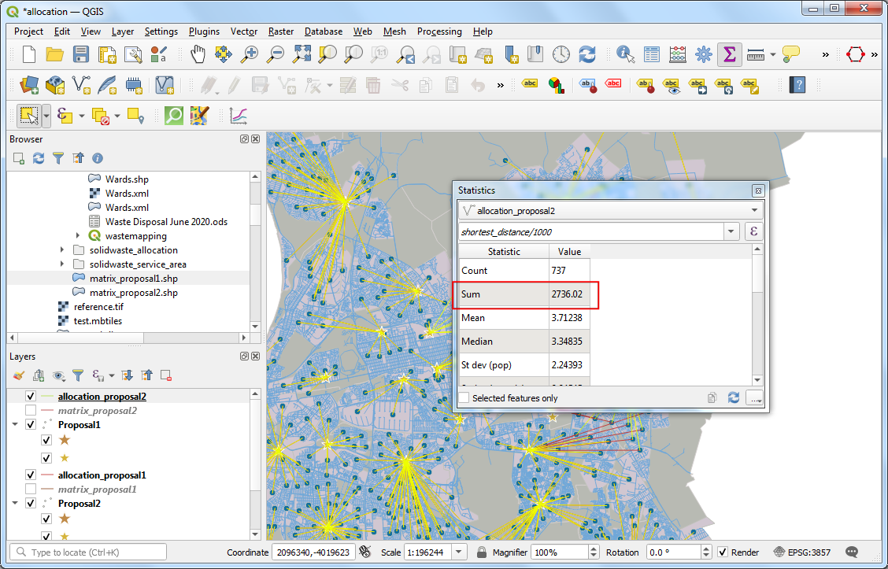

\newpage

\tableofcontents

\pagenumbering{arabic} 

\newpage

## Exercise Overview

Location-allocation analysis is used locate a set of new facilities such that the travel cost from facilities to demand-areas is minimized and assigns the closest facility to each demand point. The 'travel cost' can the total distance or travel time. In this exercise, we will evaluate 2 potential waste drop-off facilities and determine which facility is the optimal location to minimize the overall travel cost for citizens.

### Exercise Outputs

- Allocation layer showing nearest drop-off facility from each demand points.


### Datasets

- Wards: A polygon shapefile with ward boundaries of Cape Town. Available as `Wards.shp` on your data package.
- Demand Points: A point shapefile with the current waste drop-off facilities in Cape Town. Contains 2 additional facilities added for the purpose of this exercise. Available as `Drop-Offs.shp`
- Refuse Collection Beats: A polygon layer with refuse collection schedules in the City of Cape Town. Available as `Refuse_Collection_Beats`.
- Road Network: A road network for Capetown. Available as `TCT_Road_Centreline.shp`

Download the data package file `solidwaste_allocation.zip` and unzip it to a directory on your computer. It is recommended to create a common data folder for this course and keep the materials there. You can unzip them to `<home directory>/Downloads/urban_planning/`

\newpage

### Software and Plugins

This exercise uses QGIS v3.16 or above with the QNEAT3 plugin. Go to the *Plugin Manager* and install the QNEAT3 plugin.

```{r echo=FALSE, fig.align='center', out.width='75%'}

```

\newpage

## Location-Allocation Analysis

1.  Open QGIS.  Use the QGIS Browser Panel to locate the data package directory `solidwaste_allocation`. The folder comes with a QGIS project that contains pre-styled layers. Locate the `allocation` project and double-click to open it. This project contains a `demand_points` layer which represents the centroid of each waste collection beat polygon. This layer collectively represents citizens in each area that may use the waste-dropoff facility. We have 2 layers `Proposal1` and `Proposal2` that each have a new facility in addition to all existing facility. 

```{r echo=FALSE, fig.align='center', out.width='75%'}
knitr::include_graphics('images/solidwaste_allocation1.png')
```

2. The road network for the city is represented in the `TCT_Road_Centreline` layer. Open the *Attribute Table* for the layer. In addition to the *NAME*, the layer contains many attributes that can be used to compute the route. The `SPD_LMT` field contains the speed limit which can be used to find a route that minimizes the travel time. Close the *Attribute Table*.

```{r echo=FALSE, fig.align='center', out.width='75%'}

```

3. We will now compute the distances between the demand points and facilities to determine the closest facility to each point. Go to *Processing Toolbox* and locate the *QNEAT3 &rarr; Distance Matrices &rarr; OD Matrix from Layers as Lines (m:n)* tool. Double-click to open it.

```{r echo=FALSE, fig.align='center', out.width='75%'}

```

4. Select `TCT_Road_Centreline` as the *Network Layer*. Select `demand_points` as the *From-Point Layer* and `OBJECTID` as the *Unique Point ID Field*. Similarly, select `Proposal1` as the *To-Point Layer* and  `OBJECTID` as the *Unique Point ID Field*. Expand the *Advanced Parameters* section.

```{r echo=FALSE, fig.align='center', out.width='75%'}

```

5. Set `SPD_LMT` as the *Speed field*. Enter `50` as the *Topology Tolerance*. Save the *Output OD MAtrix* layer as `matrix_proposal1.shp`. Click *Run*.

> Note: This is a computationally intensive operation and can take anywhere from 10-20 minutes to run.

```{r echo=FALSE, fig.align='center', out.width='75%'}

```

6. Once the processing finishes, a new layer `matrix_proposal1` will be added. Open the *Attribute Table*. You will see that this layer contains the distance from every demand point to every other facility - along with a line segment connecting the pair. For our analysis, we only need the pair with the shortest distance. We will use an SQL Query to filter out the rows with minimum distance. Go to *Database &rarr; DB Manager..*

```{r echo=FALSE, fig.align='center', out.width='75%'}

```

7. Expand the *Virtual Layers* section and select `matrix_proposal1`. Click *SQL Window* button.

```{r echo=FALSE, fig.align='center', out.width='75%'}

```

8. Enter the following query and click *Execute*. Click the *Load as new layer*. Enter the *Layer name* as `allocation_proposal1` and click *Load*.

```
select origin_id, destinatio, geometry, min(total_cost) as shortest_distance
from 'matrix_proposal1' group by origin_id
```

```{r echo=FALSE, fig.align='center', out.width='75%'}

```

9. A new layer `allocation_proposal1` will be added. This layer shows the nearest facility from each demand point.

```{r echo=FALSE, fig.align='center', out.width='75%'}

```

10. Repeat steps 4-9 for the `Proposal2` layer. Make sure to change the layer name in the query in Step 8 to match the matrix layer name for proposal2.

```{r echo=FALSE, fig.align='center', out.width='75%'}

```

11. We will now compute the total distance for both the allocation layers. Go to *View &rarr; Statistical Summary*.

```{r echo=FALSE, fig.align='center', out.width='75%'}

```

12. Select `allocation_proposal1` layer and enter `shortest_distance/1000` as the expression. Click *Enter*. Note the distance value for *Sum*. This is the aggregate distance in KMs to the nearest waste drop-off facility from all demand points.

```{r echo=FALSE, fig.align='center', out.width='75%'}

```

13. Repeat the process for `allocation_proposal2` layer. Note the aggregate distance. The proposal with the lowest total distance is the preferred location that minimizes the overall travel time.

```{r echo=FALSE, fig.align='center', out.width='75%'}

```

\newpage


## Data Credits

- All data layers are provided by the *The City of Cape Town*. Data downloaded from [Open Data Portal (ODP)](https://odp.capetown.gov.za/) - Copyright City of Cape Town. 
- Road centerline is provided by *Transport for Cape Town*. Data downloaded from [TCT Open Data Portal](https://odp-cctegis.opendata.arcgis.com/datasets/tct-road-centreline). Copyright Cape Town Transport Directorate.

Disclaimer: This exercise provides data that has been modified for use from its original source, www.capetown.gov.za, the official website of the City of Cape Town. The City of Cape Town makes no claims as to the content, accuracy, timeliness, or completeness of any of the data provided at this site. The data provided at this site is subject to change at any time. It is understood that the data provided at this site is being used at one’s own risk.

***