\newpage

\tableofcontents

\pagenumbering{arabic} 

\newpage

## Exercise Overview

This lab exercise is designed to help you discover new mapping techniques and cartographic tools available in QGIS. You will learn how to take point data of landfills and create a proportional-symbol map showing amount of waste processed at each landfill. 

### Exercise Outputs

- A PDF map with legend created in Print Layout.

### Datasets

- Wards: A polygon shapefile with ward boundaries of Cape Town. Available as `Wards.shp` on your data package.
- Landfill Sites: A point shapefile with current, closed and proposed waste processing facilities in Cape Town. Available as `Landfill_Sites_And_Refuse_Transfer_Stations.shp`
- Waste Disposal Data: A spreadsheet with amount of waste entering City disposal facilities. Available as `Waste Disposal June 2020.ods`.

Download the data package file `solidwaste_mapping.zip` and unzip it to a directory on your computer. It is recommended to create a common data folder for this course and keep the materials there. You can unzip them to `<home directory>/Downloads/urban_planning/`

### Software and Plugins

This exercise uses QGIS v3.16 or above.


\newpage

## Mapping Waste Disposal Volumes

1. Open QGIS. Use the QGIS Browser Panel to locate the data package directory. Add the `Wards.shp` and `Landfill_Sites_And_Refuse_Transfer_Stations.shp` files.

```{r echo=FALSE, fig.align='center', out.width='75%'}
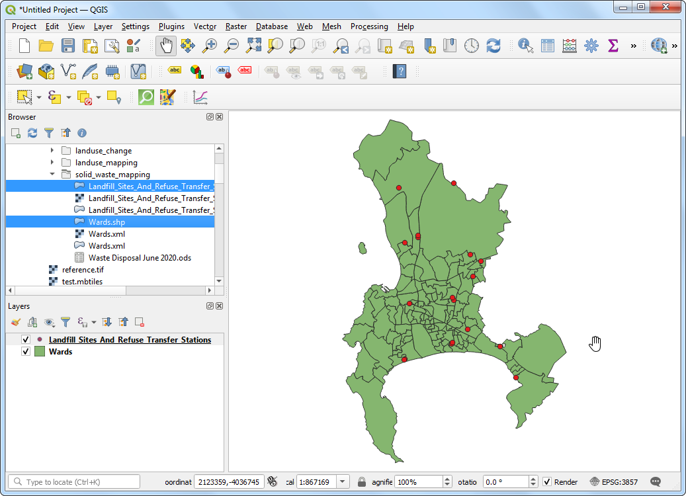
```

2. Open the *Attribute Table* of the `Landfill_Sites_And_Refuse_Transfer_Stations` layer. This layer contains all solid waste collection sites in Cape Town. You can see that the `STATUS` attribute contains whether the facilities are operational or not. We can use the values in this column to select only the *Current* facilities.

```{r echo=FALSE, fig.align='center', out.width='75%'}
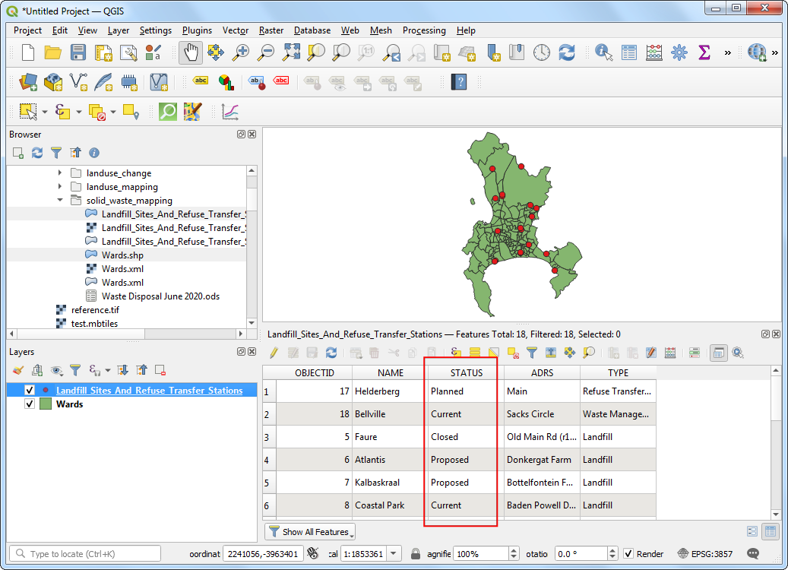
```

3. Right-click the `Landfill_Sites_And_Refuse_Transfer_Stations` layer and select *Filter..*.

```{r echo=FALSE, fig.align='center', out.width='75%'}
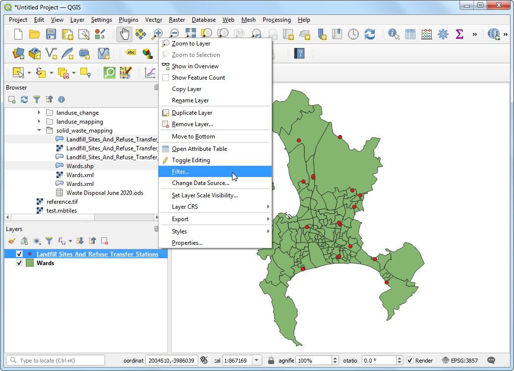
```

4. Enter the following expression and click *OK*.

```
"STATUS" = 'Current'
```

```{r echo=FALSE, fig.align='center', out.width='75%'}
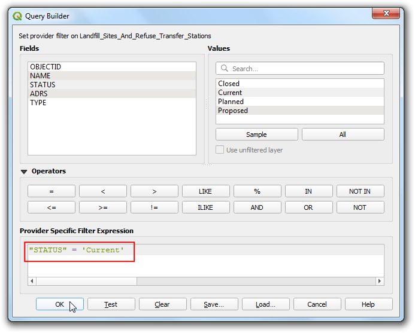
```

5. Once th filter is applied, only a subset of point will be visible on the map. Next we will add some tabular data. Add `Waste Disposal June 2020.ods` layer and click *Open Attribute Table*. This table has the name of the facility and total waste collected at the site for the month of June 2020.

```{r echo=FALSE, fig.align='center', out.width='75%'}
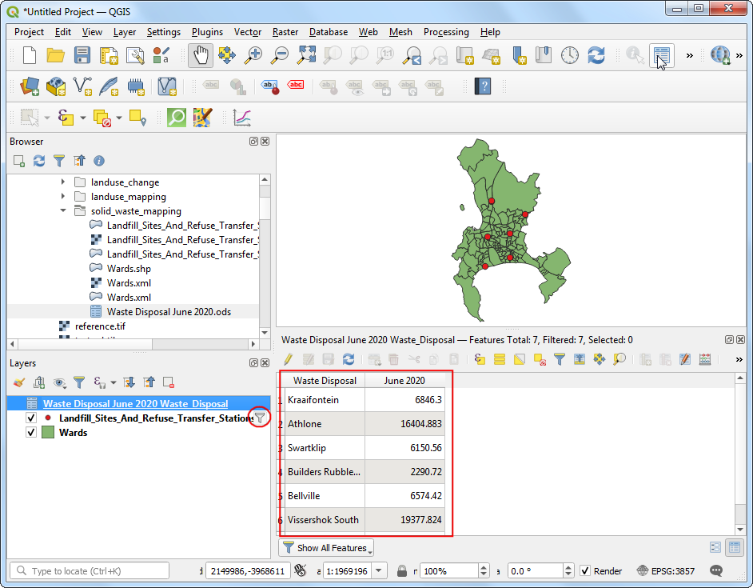
```

6. Let's join this table with the points layer. Search and locate the *Join attributes by field value* tool from the Processing Toolbox. Double-click to open it.

```{r echo=FALSE, fig.align='center', out.width='75%'}
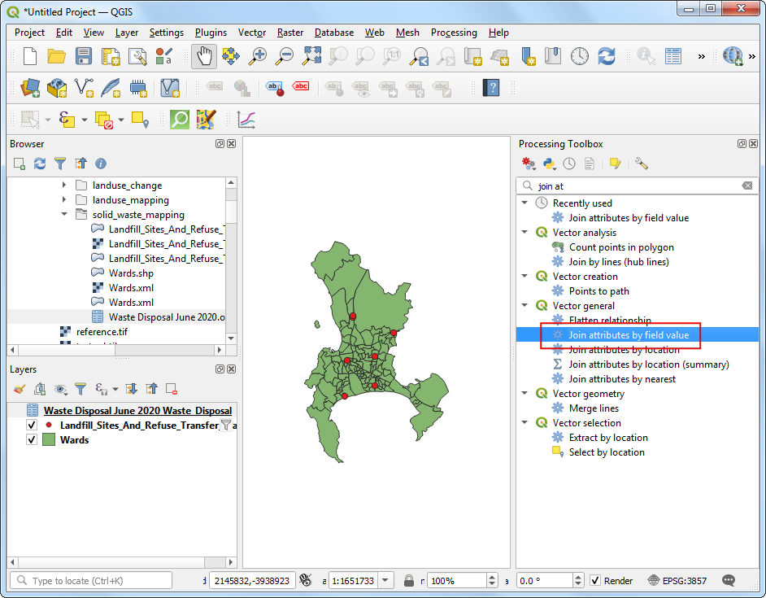
```

7. In the *Join Attributes by Field Value* dialog, select `Landfill_Sites_And_Refuse_Transfer_Stations` as the *Input layer* and `NAME` as the *Table field*. Select `Waste Disposal June 2020 Waste_Disposal` as the *Input layer 2* and `Waste Disposal` as the *Table field 2*. Check the *Discard records which could not be joined* box. Name the output layer as `waste_by_station_june2020.shp` and click *Run*.

```{r echo=FALSE, fig.align='center', out.width='75%'}
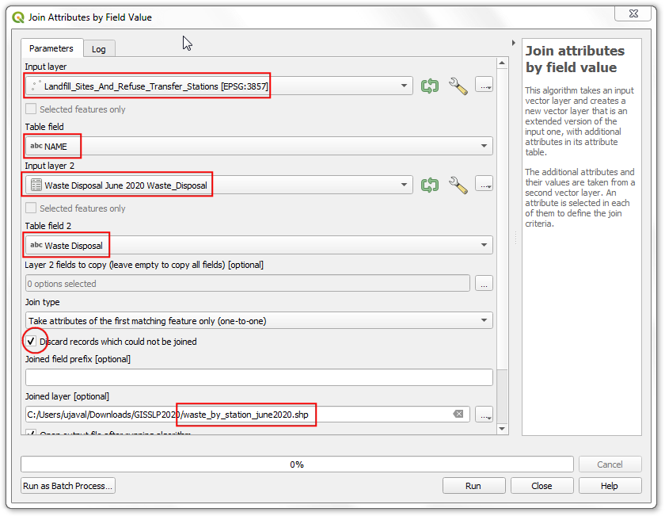
```

8. Once the processing finishes, a new layer `waste_by_station_june2020` will be added which will have the amount of waste in the *June 2020* column.

```{r echo=FALSE, fig.align='center', out.width='75%'}
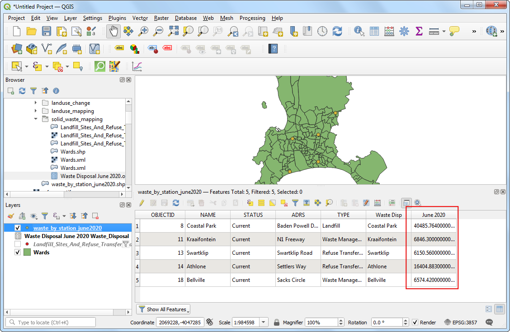
```

9. Now let's visualize this data. First select the `Wards` layer and set the symbology to `Single Symbol` with a light *Fill color* and *Stroke color*.

```{r echo=FALSE, fig.align='center', out.width='75%'}
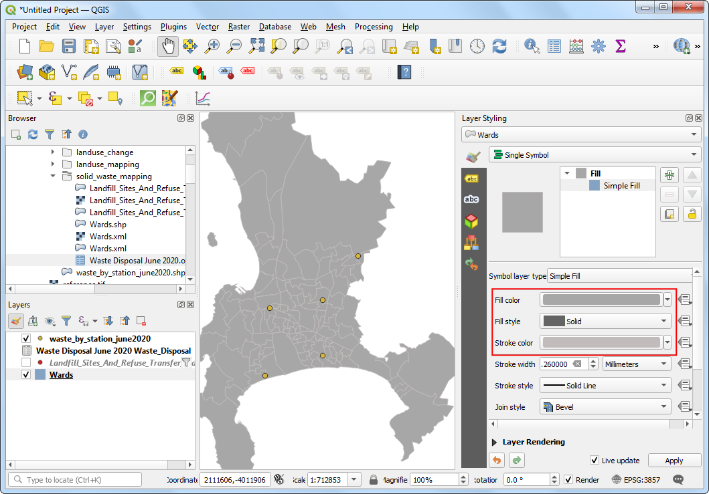
```

10. Next select the `waste_by_station_june2020` layer and select *Simple Marker* symbol. Click the drop-down for *Symbol layer type*.

```{r echo=FALSE, fig.align='center', out.width='75%'}
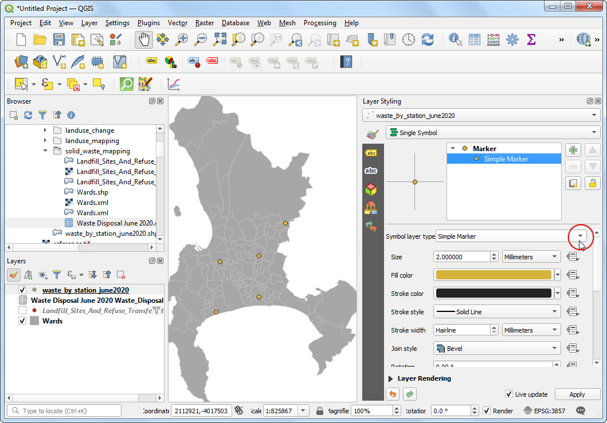
```

11. Select `Filled Marker` as the *Synbol layer type*. We will now change the size of the symbol proportional to the amount of waste collected at the site. To do this, we must apply a *Data-defined Override* - which can apply a field value or expression to calculate the size for each feature. Click the *Date-defined Override* button next to *Size* and select *Edit...*.

```{r echo=FALSE, fig.align='center', out.width='75%'}
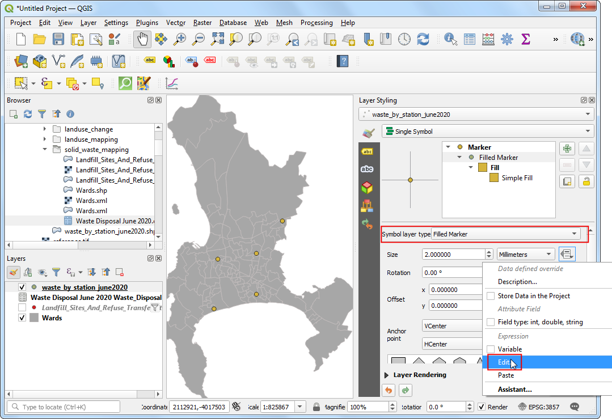
```

12. Enter the follow expression. We are trying to scale the waste amount to a number will be the diameter of the circle on the map. Click *OK*.

```
"June 2020" / 3
```

```{r echo=FALSE, fig.align='center', out.width='75%'}
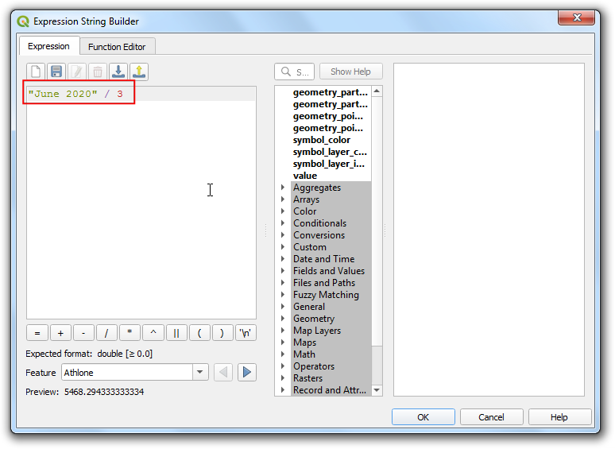
```

13. Change the units to *Map Units* (which are in meters). You will see the circles of different size for each point. The data-defined override button will turn yellow indicating that an override is applied for that value.

```{r echo=FALSE, fig.align='center', out.width='75%'}
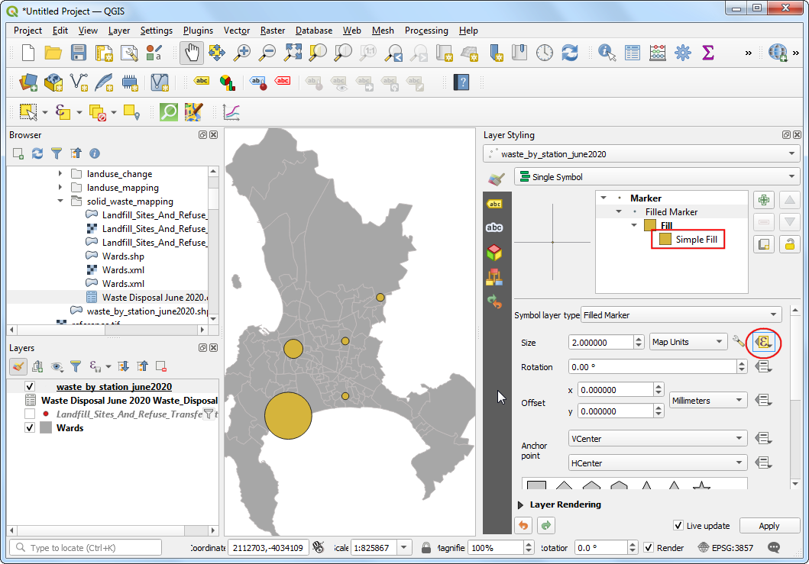
```

14. Let's explore more advanced styling options. Change the *Symbol layer type* to `Shapeburst Fill`. Select 2 colors of your choice to render the circles with a gradient fill.

```{r echo=FALSE, fig.align='center', out.width='75%'}
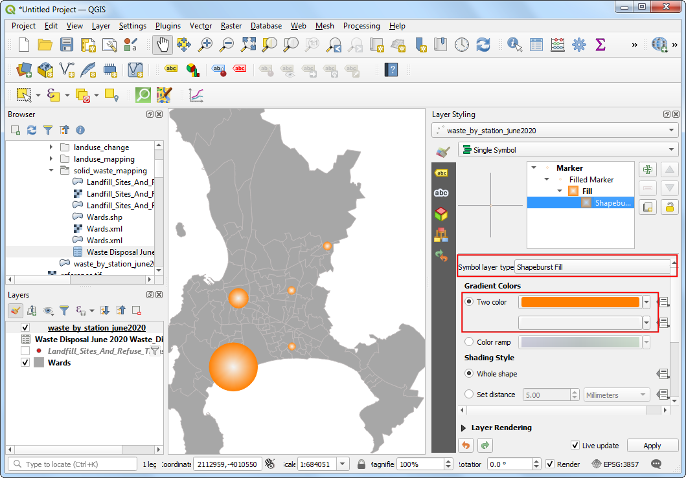
```

15. Next we will apply a *Drop-shadow* effect to the circles to make them pop-out on the map. These are known as *Live Layer Effects*. Scroll down and expand the *Layer Rendering* section. Check the *Draw effects* button and click the *Star* button.

```{r echo=FALSE, fig.align='center', out.width='75%'}
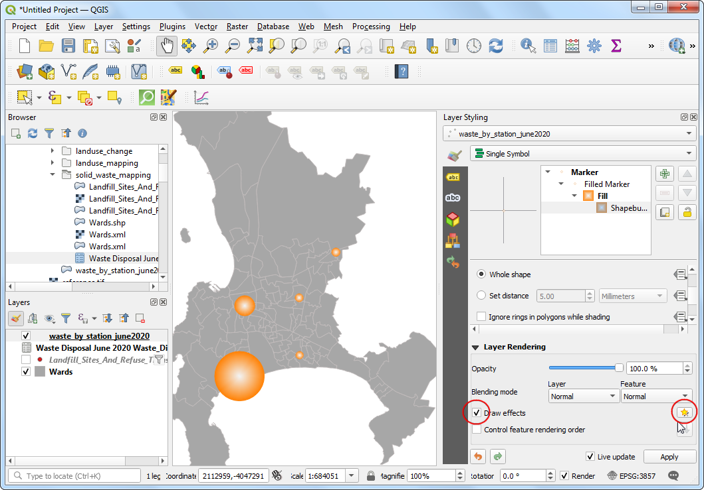
```

16. Enable the *Drop Shadow* option.

```{r echo=FALSE, fig.align='center', out.width='75%'}
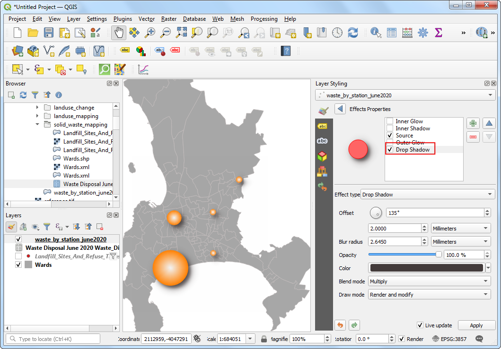
```

17. The map looks pretty good now, but the reader of your map will now know what values these symbols represent. It will be good to have an interpretable legend. Click *Back* button till you are back in the main *Layer Styling* dialog. Select *Marker* and click on the *Advanced* button at the bottom. Select *Date-defined Size Legend*.

```{r echo=FALSE, fig.align='center', out.width='75%'}
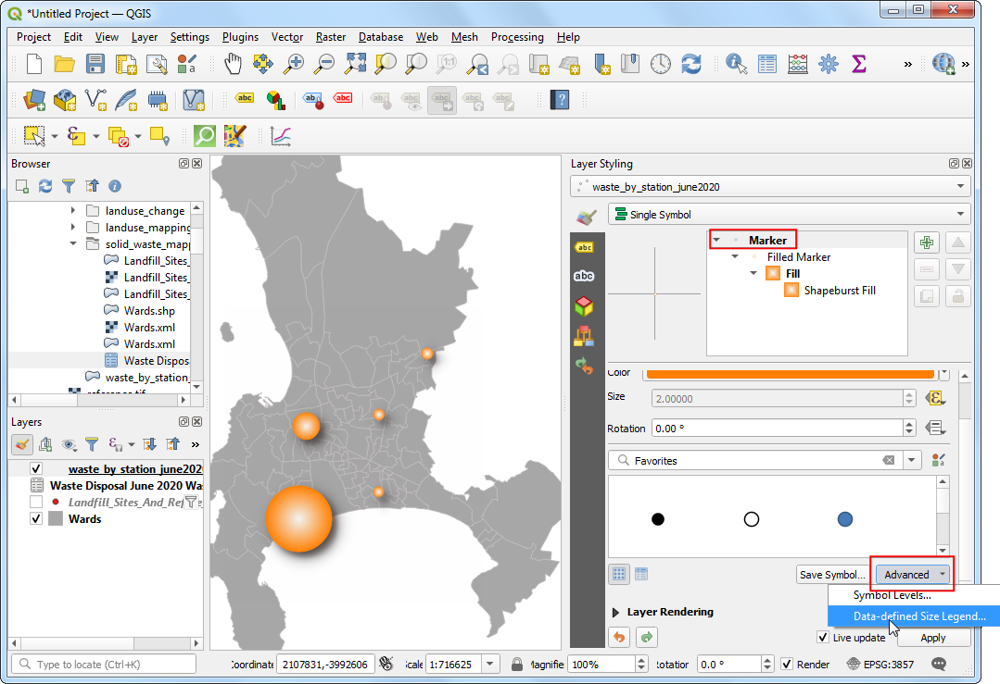
```

18. Enter `Waste Collected (Tonnes)` as the *Title* and click the *+* button to add legend entries. Since our symbols are scaled by a factor of 3, enter the appropriate *value* and *Label*. You will see a nice legend now appear in the *Layers* panel. The same legend will be available in the *Print Layout* if you wished to create a map from this data.

```{r echo=FALSE, fig.align='center', out.width='75%'}
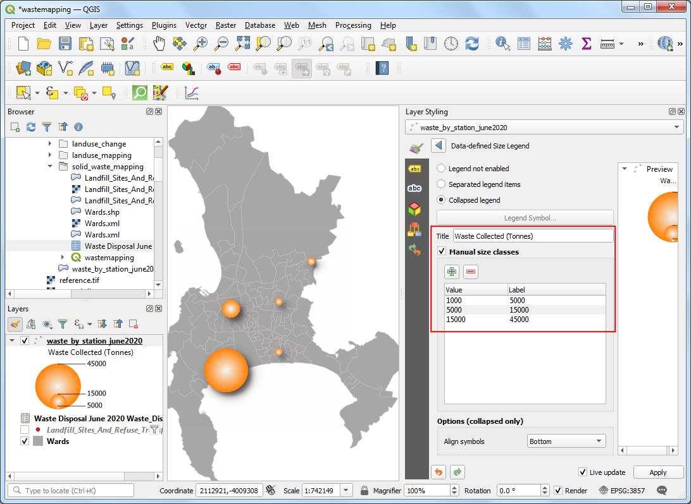
```

19. Close the *Layer styling* panel. The visualization is ready. You learnt how to turn a data in a table to a visually informative and attractive map.

```{r echo=FALSE, fig.align='center', out.width='75%'}
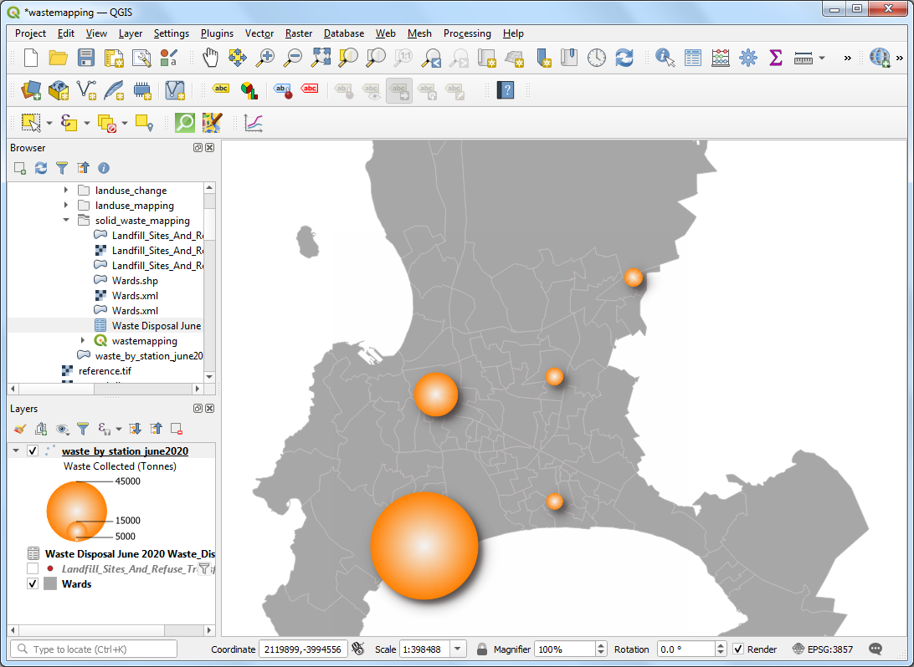
```

\newpage


## Data Credits

- All data layers are provided by the *The City of Cape Town*. Data downloaded from [Open Data Portal (ODP)](https://odp.capetown.gov.za/) - City of Cape Town. 

Disclaimer: This exercise provides data that has been modified for use from its original source, www.capetown.gov.za, the official website of the City of Cape Town. The City of Cape Town makes no claims as to the content, accuracy, timeliness, or completeness of any of the data provided at this site. The data provided at this site is subject to change at any time. It is understood that the data provided at this site is being used at one’s own risk.

***