\newpage

\tableofcontents

\pagenumbering{arabic} 

\newpage

## Exercise Overview

Service area analysis is useful in evaluating what areas can be served from facilities within a certain distance or time. In this exercise, we will take locations of waste collection facilities and determine which areas of the city are within 15-minutes of driving time. This will allow us to determine opportunities for improving the service delivery with potential new locations.

### Exercise Outputs

- A map showing drive-time polygons from each facility.

### Datasets

- Wards: A polygon shapefile with ward boundaries of Cape Town. Available as `Wards.shp` on your data package.
- Landfill Sites: A point shapefile with current, closed and proposed waste processing facilities in Cape Town. Available as `Landfill_Sites_And_Refuse_Transfer_Stations.shp`
- Refuse Collection Beats: A polygon layer with refuse collection schedules in the City of Cape Town. Available as `Refuse_Collection_Beats`.

Download the data package file `solidwaste_service_area.zip` and unzip it to a directory on your computer. It is recommended to create a common data folder for this course and keep the materials there. You can unzip them to `<home directory>/Downloads/urban_planning/`

\newpage

### Software and Plugins

This exercise uses QGIS v3.16 or above with the ORS Tools Plugin. This plugin requires signing up for an account an getting a free API Key. Please follow the instructions below to sign-up for a key


1.  Visit Openrouteservice Sign Up page https://openrouteservice.org/dev/#/signup and create an account. Once your account is activated, visit your Dashboard and request a token. Select Free as the Token type and enter ORS Tools QGIS as the Token name. Click CREATE TOKEN.

```{r echo=FALSE, fig.align='center', out.width='75%'}
knitr::include_graphics('images/ors1.png')
```

2. Once created, copy the long string displayed under Key. This is a unique identifier linked with your account that will be used to authorize use of this service. We will use this key later in the exercise.

```{r echo=FALSE, fig.align='center', out.width='75%'}
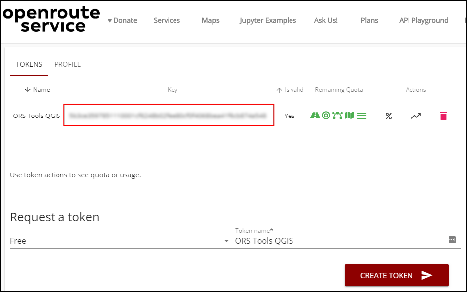
```

\newpage

## Service Area Analysis

1. Open QGIS.  Use the QGIS Browser Panel to locate the data package directory `solidwaste_service_area`. The folder comes with a QGIS project that contains pre-styled layers. Locate the `service_area` project and double-click to open it. The map displays Refuse Collection Beats polygons styled by the color of their collection area. These beats represented populated areas of the city. There are 2 point layers. `Current` layer shows the location of currently operational waste transfer facilities where the waste collected from each households is brought by service providers for processing. The `Current+Proposed` layer contains location of new facilities that are planned by the city.

```{r echo=FALSE, fig.align='center', out.width='75%'}
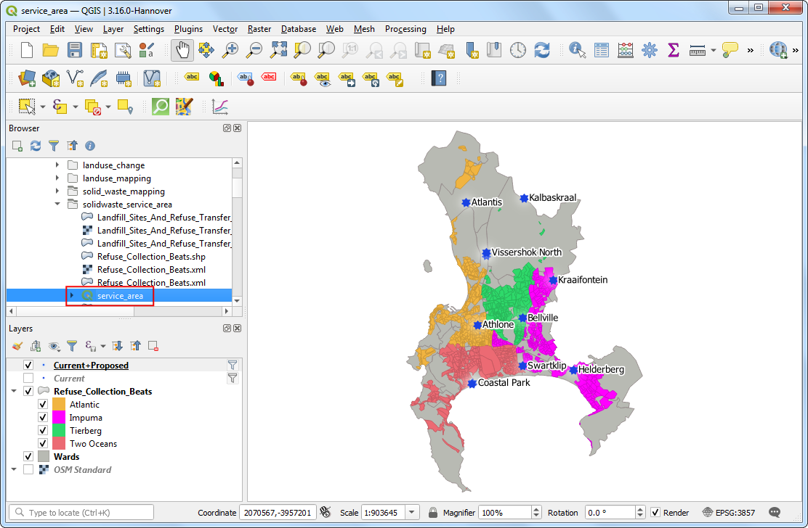
```

2. We will use the *ORS Tools* plugin to do network analysis in QGIS. ORS Tools plugin uses OpenStreetMap (OSM) data and uses a free web-service such as Openrouteservice (ORS) that can perform complex routing tasks. Visit *Plugins &rarr; Manage and Install plugins*. Search for *ORS Tools* plugin and install it. Click Close.

```{r echo=FALSE, fig.align='center', out.width='75%'}
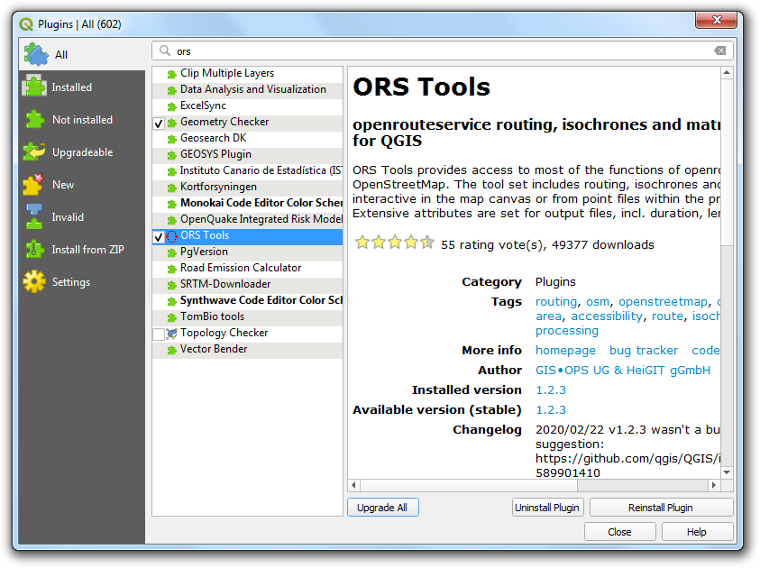
```

3. In the main QGIS Window, go to *Web &rarr; ORS Tools &rarr; Provider Settings*.

```{r echo=FALSE, fig.align='center', out.width='75%'}
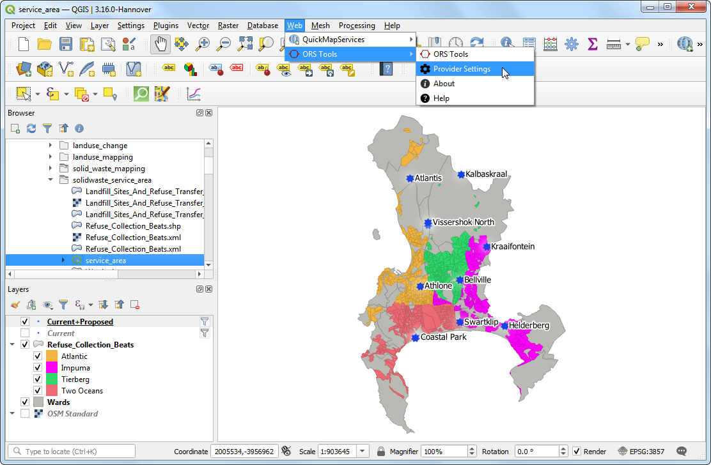
```

4. Expand the openrouteservice section and paste the key (copied in the previous section) in the API Key text-box. Click OK.

```{r echo=FALSE, fig.align='center', out.width='75%'}
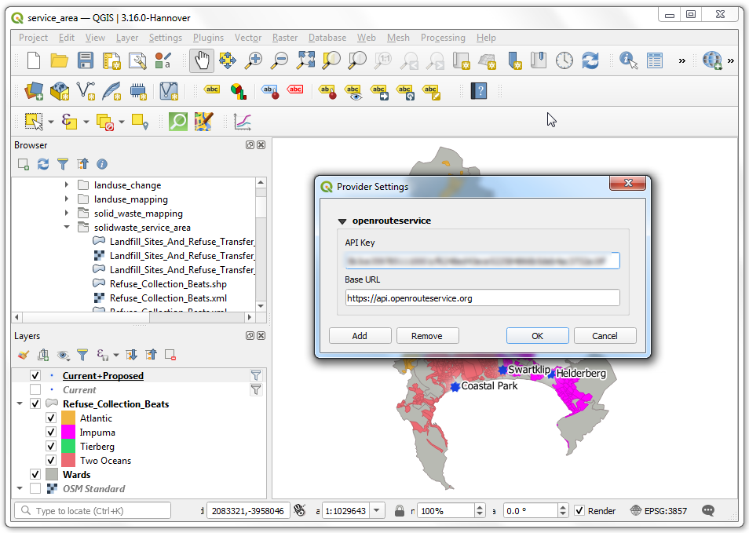
```

5. Now we are ready to start the network analysis. In the Processing Toolbox, search for and locate the *ORS Tools &rarr; Isochrones &rarr; Isochrones From Layer* tool. Double-click to launch it.

```{r echo=FALSE, fig.align='center', out.width='75%'}
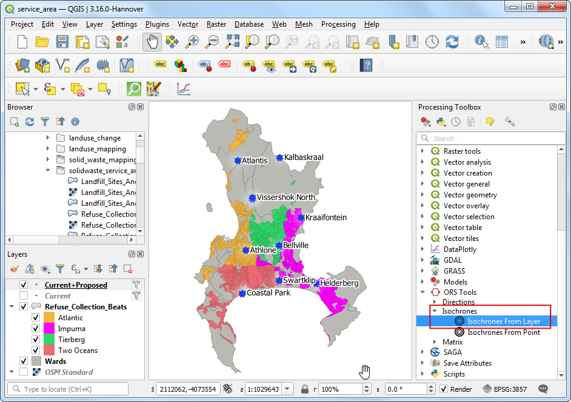
```

6. Select `Current` as the *Input Point layer*. Set `OBJECTID` as the *Input layerID Field*. Enter `15` minutes as the *Comma-separated ranges*. Save the *Isochrones* layer as `current_service_area.shp`. Click *Run*.

```{r echo=FALSE, fig.align='center', out.width='75%'}
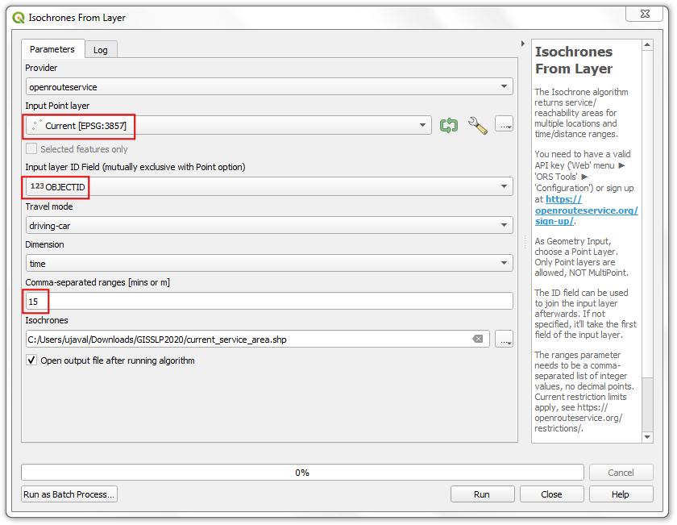
```

7. Run the same tool again with the `Current+Proposed` layer as the  *Input Point layer* while keeping other settings the same. Save the layer as `future_service_area.shp`. Click *Run*.

```{r echo=FALSE, fig.align='center', out.width='75%'}
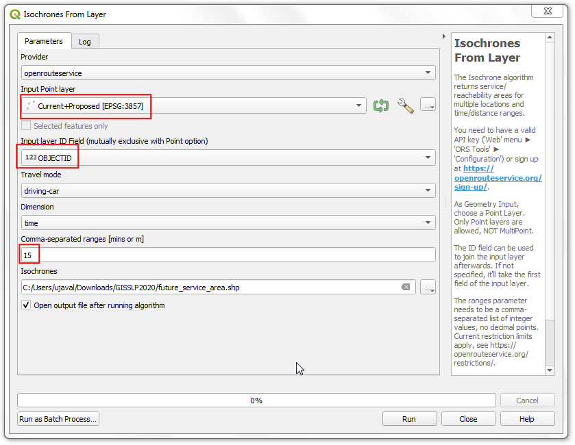
```

8. You will have 2 new layers with 15-minute drive time polygons along the road network from the current and future transfer stations. Click *Open the layer styling panel* button.

```{r echo=FALSE, fig.align='center', out.width='75%'}
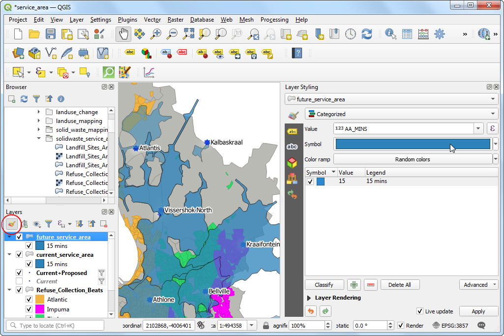
```

9. Select the *Symbol* and select a different color for both the layers. By default - the layers are added with a transparency. Expand the *Layer Rendering* section and change the *Opacity* to `100%`.

```{r echo=FALSE, fig.align='center', out.width='75%'}
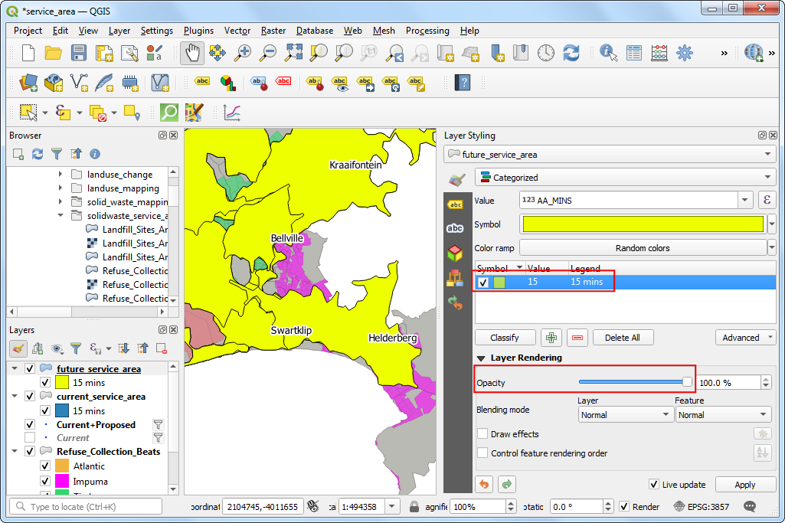
```

10. You can change the order of the layers so the `current_service_area` layer is at the top. You will see the increase in the coverage after the new stations get operational. Solid waste collection vehicles will have to travel much lesser distance to transfer the waste for neighborhoods in certain parts of the city. You also see areas that are still located much outside the 15-minute catchment area. These present an opportunity for the city to plan additional facilities to reduce travel time, save fuel and reduce emissions.

```{r echo=FALSE, fig.align='center', out.width='75%'}
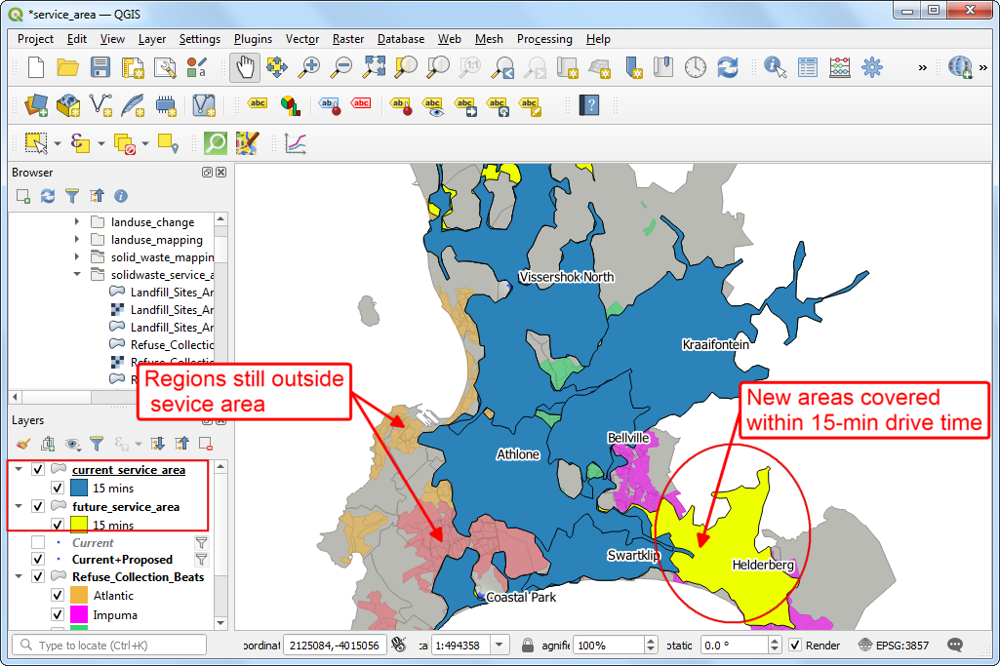
```

\newpage


## Data Credits

- All data layers are provided by the *The City of Cape Town*. Data downloaded from [Open Data Portal (ODP)](https://odp.capetown.gov.za/) - City of Cape Town. 

Disclaimer: This exercise provides data that has been modified for use from its original source, www.capetown.gov.za, the official website of the City of Cape Town. The City of Cape Town makes no claims as to the content, accuracy, timeliness, or completeness of any of the data provided at this site. The data provided at this site is subject to change at any time. It is understood that the data provided at this site is being used at one’s own risk.

***