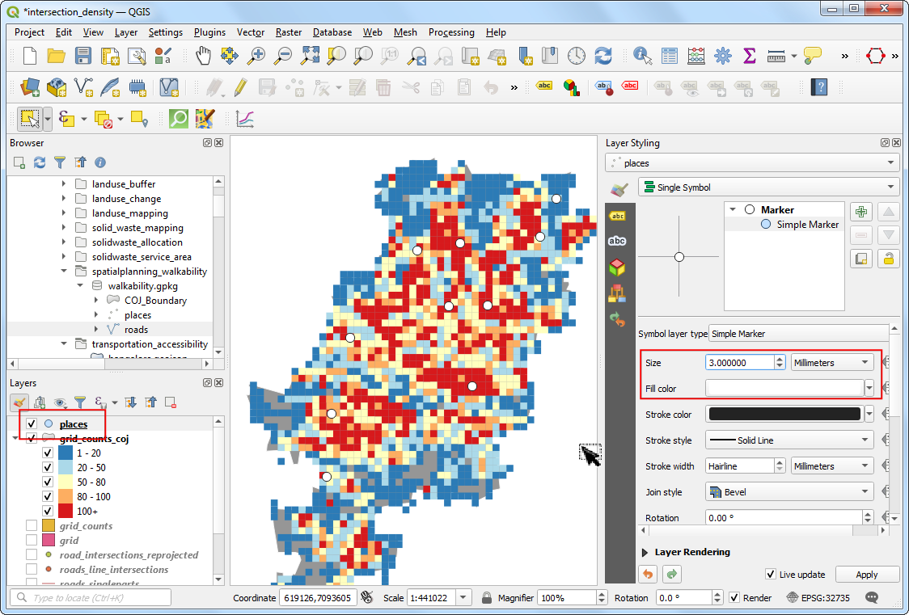

\newpage

\tableofcontents

\pagenumbering{arabic} 

\newpage

## Exercise Overview

An import aspect of spatial planning involves analyzing fragmentation and disconnection at a regional level. Certain types of development result in urban spatial form that is non inclusive. These are characterized by controlled street patterns that have moved from the open grid to the clustered cul-de-sac, loop and ‘lollipop’ configuration contributing to fragmentation and low levels of walkability.Intersection density is an objective method of assessing this aspect of the built environment. High intersection density corresponds to a more walkable and inclusive environment. While walkability is a multi-dimensional problem - intersection density gives an useful perspective that shows a positive correlation with walkability and access to transportation.

In this exercise, we will take the road network data from OpenStreetMap for the City of Johannesburg and calculate the intersection density using a 1km x 1km grid overlay.

### Exercise Outputs

- A grid layer with counts of road intersections
- A map with label call-outs for all the towns

### Datasets

- City of Johannesburg Boundary: Polygon shapefile provided by City of Johannesburg Spatial Development Framework 2040. Available as a layer `COJ_Boundary` in  `walkability.gpkg`. 
- Towns: Point shapefile provided by City of Johannesburg Spatial Development Framework 2040. Available as a layer `places` in `walkability.gpkg`. 
- Road Network: Line shapefile of all streets within the City of Johannesburg from OpenStreetMap. Available as a layer `roads` in `walkability.gpkg`. 

Download the data package file `spatialplanning_walkability.zip` and unzip it to a directory on your computer. It is recommended to create a common data folder for this course and keep the materials there. You can unzip them to `<home directory>/Downloads/urban_planning/`


### Software and Plugins

This exercise uses QGIS v3.16

\newpage


## Exercise: Extract Road Intersections


1. Open QGIS.  Use the QGIS Browser Panel to locate the data package directory `spatialplanning_walkability`. Expand the `walkability.gpkg`. Drag-and-drop the `COJ_Boundary`, `places` and `roads` layers to the canvas.

```{r echo=FALSE, fig.align='center', out.width='75%'}

```

2. The first task is to extract the road intersections. This can be done using the built-in *Line intersections* tool. Let's test this on a small subset first to see if the results are satisfactory. Select the `roads` layer,use the *Select features by Area* tool and select a few roads. Open the *Processing Toolbox* and locate the *Vector overlay &rarr; Line intersections* tool. Double-click to open it.

```{r echo=FALSE, fig.align='center', out.width='75%'}

```

3. Select `roads` as both *Input layer* and *Intersect layer*. Make sure to check the *Selected features only*. Click *run*.

```{r echo=FALSE, fig.align='center', out.width='75%'}

```

4. A new layer *Intersections* will be added. You will notice that while most intersection points are correct, there are some false positives. This is because the algorithm considers intersections of each line segment as a valid intersection. But for out analysis, we need to extract only the intersections when 2 or more streets intersect.

```{r echo=FALSE, fig.align='center', out.width='75%'}

```

5. Remove the *Intersections* layer and click *Deselect features from all layers* button to remove the selection. We will now merge all adjacent road segments so the segments between intersections are merged into a single feature. Locate the *Vector geometry &rarr; Dissolve* tool. Double-click to open it.

```{r echo=FALSE, fig.align='center', out.width='75%'}

```

6. Select `roads` as the *Input layer*. Enter the *Dissolved* output layer name as `roads_dissolved.gpkg`. Click *Run*.

```{r echo=FALSE, fig.align='center', out.width='75%'}

```

7. The resulting layer has all the road segments merged into a single feature. Next, use the *Vector geometry &rarr; Multipart to singleparts* tool. Double-click to open it. Select `roads_dissolved` layer as the *Input layer*. Enter `roads_singleparts.gpkg` as the *Single parts* output. Click *Run*.

```{r echo=FALSE, fig.align='center', out.width='75%'}

```

8. The resulting layer `roads_singleparts` will have all adjacent segments merged. We can now run the *Vector overlay &rarrl Line intersections* algorithm. Double-click to launch it.

```{r echo=FALSE, fig.align='center', out.width='75%'}

```

9. Select `roads_singleparts` as both *Input layer* and the *Intersect layer*. Name the *Intersections* output layer as `roads_line_intersections.gpkg`. Click *Run*.

> Note: This is a computationally intensive operation and may take upto 15 minutes to finish.

```{r echo=FALSE, fig.align='center', out.width='75%'}

```

10. The resulting layer now has all intersections correctly identified. But it is still not perfect. Use the *Select features by Area* tool and select any intersection. You will see that at each intersection there are many duplicate points from adjacent segments. If we use this layer for further analysis, it will result in an inflated number of intersections. Let's remove duplicates using the *Vector general &rarr; Delete duplicate geometries* tool. Select `roads_line_intersections` as the *Input layer* and enter `road_intersections.gpkg` as the *Cleaned* output layer. Click *Run*.

```{r echo=FALSE, fig.align='center', out.width='75%'}

```

11. Once the processing finishes a new layer `road_intersections` will be added. This layer has the correct number of road intersections extracted from the source layer.

```{r echo=FALSE, fig.align='center', out.width='75%'}

```

\newpage

## Exercise: Calculate Grid Density

1. We will now learn another technique for density mapping. You learnt about Kernel Density Estimation earlier. We can compute density of points by overlaying a regular grid and counting points in each grid polygon. Before we can create a grid, we must reproject the data to a projected CRS so we can use linear units. Open *Vector general &rarr; Reproject layer*.

```{r echo=FALSE, fig.align='center', out.width='75%'}

```

2. Select `road_intersections` as the *Input layer*. Search and select `EPSG:32735 - WGS 84 / UTM zone 35S` as the *Taget CRS*. Enter the *Reprojected* output layer as `road_intersections_reprojected.gpkg`. Click *Run*.

```{r echo=FALSE, fig.align='center', out.width='75%'}

```

3. Once the processing finishes and the `road_intersections_reprojected` layer is added, right-click and select *Layer CRS &rarr; Set Project CRS from Layer*.

```{r echo=FALSE, fig.align='center', out.width='75%'}

```

4. Now we can create the grid using the *Vector creation &rarr; Create grid*.

```{r echo=FALSE, fig.align='center', out.width='75%'}

```

5. Select *Grid type* as `Rectangle (Polygon)`. Click the *...* button for *Grid extent* and select *Calculate from Layer &rarr; road_intersections_reprojected*.

```{r echo=FALSE, fig.align='center', out.width='75%'}

```

6. Set both *Horizontal* and *Vertical* spacing as `1000` `meters`. Name the *Grid* output layer as `grid.gpkg`. Click *Run*.

```{r echo=FALSE, fig.align='center', out.width='75%'}

```

7. A layer containing rectangular grid polygons will be created. We can now count the number of points in each polygon. but since our layers are quite large, this process can take a long time. One way to speed up spatial operations is to use a *Spatial Index*. Launch the *Vector general &rarr; Create spatial index* tool.

```{r echo=FALSE, fig.align='center', out.width='75%'}

```

8. Create spatial index for both `road_intersections_reprojected` and `grid` layers.

```{r echo=FALSE, fig.align='center', out.width='75%'}

```

9. Launch the *Vector analysis &rarr; Count points in polygon* algorithm.

```{r echo=FALSE, fig.align='center', out.width='75%'}

```

10. Select `grid` as the *Polygon* layer and `road_intersections_reprojected` as the *Points* layer. Name the *count* output layer as `grid_counts.gpkg`. Click *Run*.

```{r echo=FALSE, fig.align='center', out.width='75%'}

```

11. The resulting layer will have an attribute `NUMPOINTS` containing the number of intersection points within each grid. There are many grids with 0 points. It will help our analysis and visualization to remove grid polygons which have no intersections.Locate the *Vector selection &rarr; Extract by expression* algorithm.

```{r echo=FALSE, fig.align='center', out.width='75%'}

```

12. Select `grid_counts` as the *Input layer*. Enter `"NUMPOINTS" > 0` as the *Expression*. Enter the *Matching features* output layer as `grid_counts_coj.gpkg`. Click *Run*.

```{r echo=FALSE, fig.align='center', out.width='75%'}

```

13. The resulting layer will have grid polygons over the city of Johannesburg and contains number of road intersections as an attribute for each polygon.

```{r echo=FALSE, fig.align='center', out.width='75%'}

```

\newpage

## Exercise: Visualize Walkability

1. Now we can visualize the pattern of road intersection density across the city to identify areas with high and low walkability. Select the `grid_counts_coj` and open the *Layer Styling Panel*. Select *Graduated* renderer, a ramp of your choice and click *Classify*. A value of > 100` intersections / sq.km is an ideal for walkability, so you can choose the bucket values to reflect that. To aid our visualization, we can make the stroke color transparent for the grid cells. Click the *Symbol* and choose *Configure symbol*.

```{r echo=FALSE, fig.align='center', out.width='75%'}

```

2. In the *Symbol Settings*, choose *Simple Fill* and set the *Stroke color* to `Transparent`. Click the *Back* button.

```{r echo=FALSE, fig.align='center', out.width='75%'}

```

3. Drag the `places` layer to the top. In the *Layer styling* panel, increase the *Size* to `3` and choose a light *Fill color*.

```{r echo=FALSE, fig.align='center', out.width='75%'}

```

4. Switch to the *Labels* tab. Select *Single Labels* and pick `TOWN` as the *Value*.

```{r echo=FALSE, fig.align='center', out.width='75%'}

```

5. We will now learn how to manually move the labels to an appropriate place. Select the *Move a Label or Diagram* tool and click on the map. A pop-up dialog will show asking you to choose a primary key. This is to store the position of each label with the feature in the QGIS project. Select `fid` and click *OK*. 

```{r echo=FALSE, fig.align='center', out.width='75%'}

```

6. Move the labels outside of the grid areas by dragging them.

```{r echo=FALSE, fig.align='center', out.width='75%'}

```

7. In the *Layer Styling* panel, switch to the *Callouts* tab and check the *Draw callouts* option.

```{r echo=FALSE, fig.align='center', out.width='75%'}

```

8. Make any necessary adjustments to the map. Your visualization is now ready. You may create a map from this using the *Print Layout* with a legend and other map elements if you wish.

```{r echo=FALSE, fig.align='center', out.width='75%'}

```

\newpage

## References

* [EnviroAtlas Fact Sheet](https://enviroatlas.epa.gov/enviroatlas/DataFactSheets/pdf/Supplemental/Estimatedintersectiondensityofwalkableroads.pdf): Published by the U.S. Environmental Protection Agency. 
* [Spatial Development Framework 2040](http://bit.ly/joburg-sdf-16):  City of Johannesburg Metropolitan Municipality


## Data Credits

- Roads: Shapefile downloaded from Geofabrik. https://download.geofabrik.de/ (c) OpenStreetMap contributors
- COJ Boundary and Towns: Shapefiles downloaded from [Spatial Development Framework 2040](http://bit.ly/joburg-sdf-16)

***