\newpage

\tableofcontents

\pagenumbering{arabic} 

\newpage

## Exercise Overview

When planning for transit-oriented development (TOD), a useful criteria is accessibility to public transport. In this analysis, we will determine what percentage of population in the city of Bangalore, India live within 1km of a metro station. To carry out this analysis, we will first query OpenStreetMap database to get the location of functioning metro stations in the city. Then we calculate a 1km buffer and combine it with a population grid from WorldPop to determine the population statistics.

### Exercise Outputs

- A polygon layer with buffer area around the metro stations and total population within the buffer.

### Datasets

- Bangalore city boundary: Provided by DataMeet. Available as `bangalore.geojson`.
-  Population Grid raster: Provided by WorldPop. Available as 

Download the data package file `transportation_accessibility.zip` and unzip it to a directory on your computer. It is recommended to create a common data folder for this course and keep the materials there. You can unzip them to `<home directory>Downloads/urban_planning/`

\newpage

### Software and Plugins

This exercise uses QGIS v3.16 or above with following plugins.

* QuickOSM

## Exercise: Analyze Metro Rail Accessiblity


1. Locate the ``bangalore.geojson`` file and drag it to the canvas. This polygon layer represents the city boundary.

```{r echo=FALSE, fig.align='center', out.width='75%'}
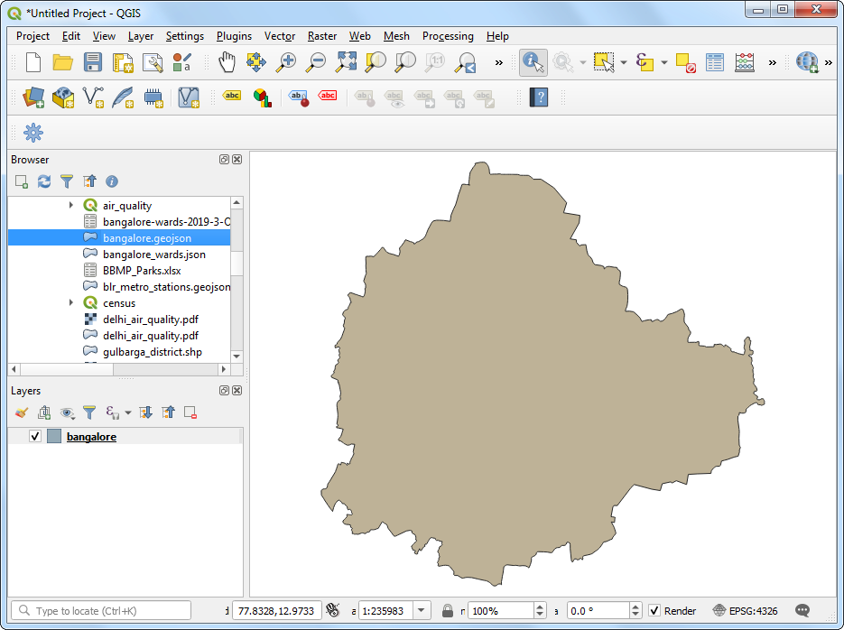
```

2. Now we will query OpenStreetMap to get a vector layer of railway stations in the city. Go to *Plugins &rarr; Manage and Install Plugins* and install the **QuickOSM** plugin. After installation go to **Vector &rarr; QuickOSM &rarr; QuickOSM**. OpenStreetMap uses a tagging system to record properties of physical features. The tags and the key/value pairs are described in [OpenStreetMap wiki](https://wiki.openstreetmap.org/wiki/Map_Features). The railway stations are tagged with ``railway=station``. Enter ``railway`` as the *Key*, ``station`` as the *Value* and *Bangalore* as the geographic filter *In*. Expand the *Advanced* section and check only the *Node* and *Points* boxes. Click *Run Query*.

```{r echo=FALSE, fig.align='center', out.width='75%'}
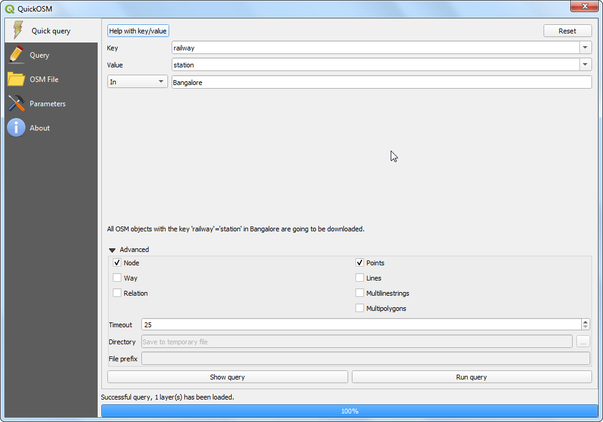
```

3. Once the query finishes, you will see a new layer ``railway_station_Bangalore`` loaded in the canvas. This includes all railway stations - including the ones operator by Indian Railways and stations under constructions. We can apply a filter to select only the operational metro stations. Right-click the layer and select *Filter*.

```{r echo=FALSE, fig.align='center', out.width='75%'}
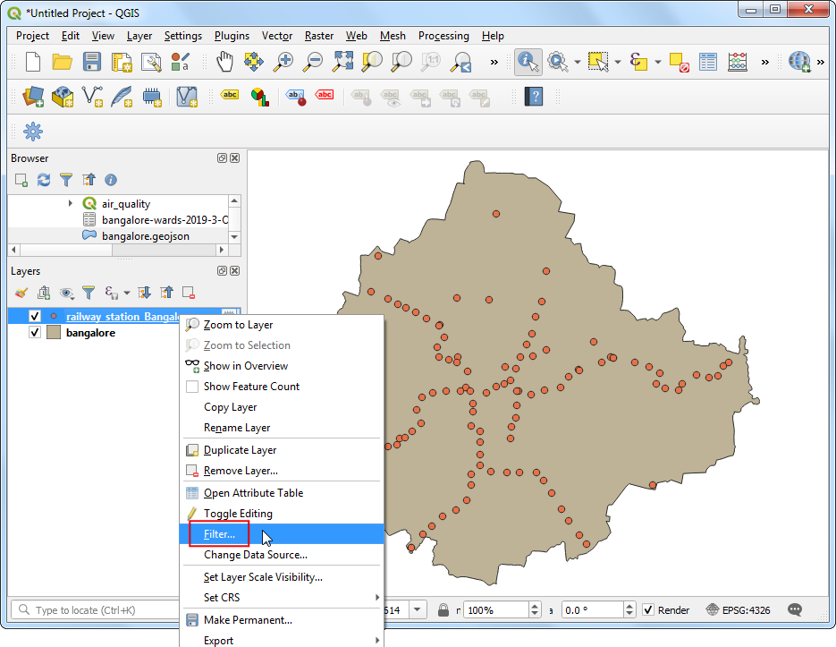
```

4. In the *Query Builder* enter the following expression and click *OK*.

```
"operator" = 'BMRCL' AND "disused" != 'yes' AND "disused:railway" != 'station'
```

```{r echo=FALSE, fig.align='center', out.width='75%'}
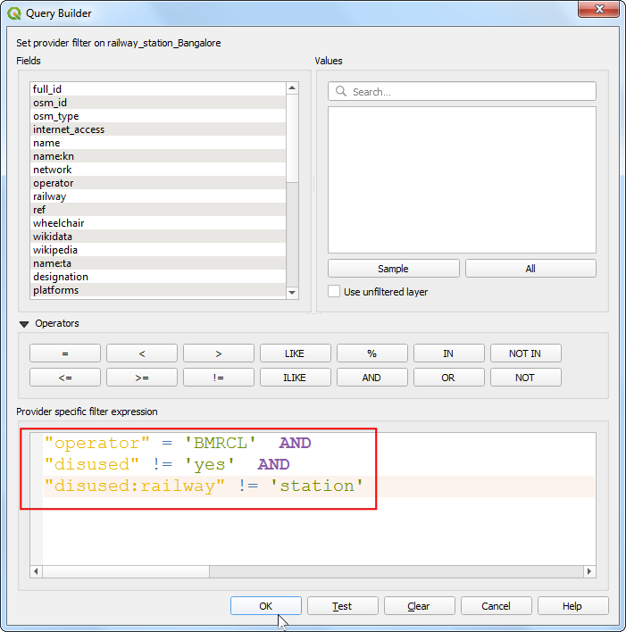
```

5. Now the map will update to show only the operation metro stations in the city. Next, we need to apply a *Buffer* to these stations to find areas within 1km. But our data comes in the EPSG:4326 WGS84 Geographic Projection - which has degrees as units. To do geoprocessing operations on this layer in projected units such as kilometers, we must first reproject the layer in a suitable projected coordinate reference system (CRS). Go to **Processing &rarr; Toolbox**. Search for and locate the **Vector general &rarr; Reproject layer** algorithm. Double-click to launch it.

> Tip: You can use the ORS Tools plugin to compute 1 km walking isochrones instead of buffers which will be a more accurate representation of the accessibility.

```{r echo=FALSE, fig.align='center', out.width='75%'}
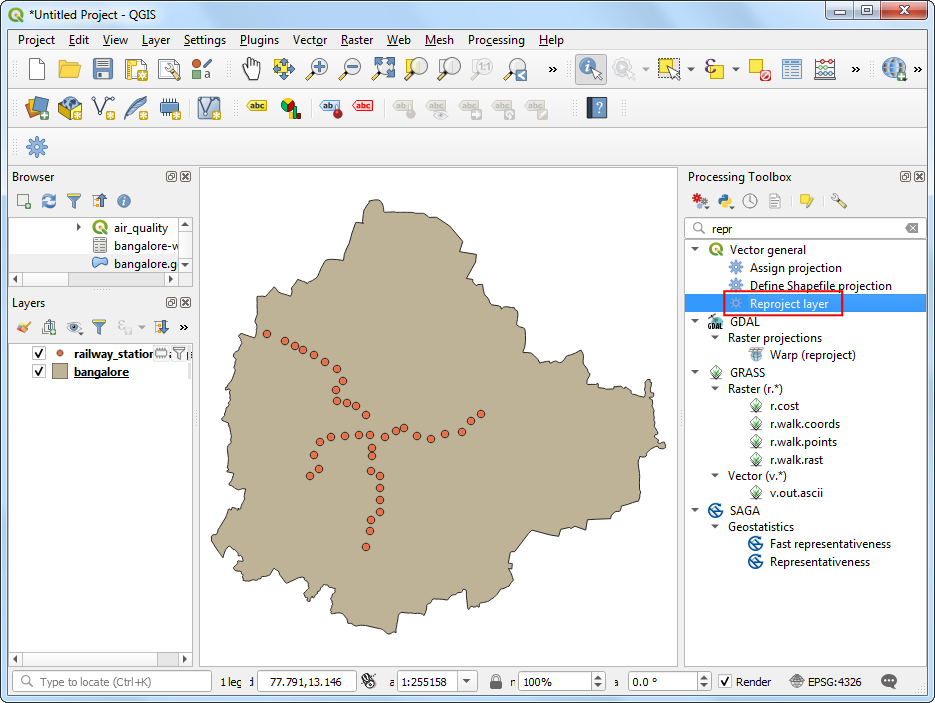
```

6. Choose  ``railway_station_Bangalore`` as the *Input layer*. Select ``EPSG:32643 - WGS 84 UTM Zone 43N`` as the *Target CRS*. Name the *Reprojected* layer as ``metro_stations_reprojected.gpkg``.

```{r echo=FALSE, fig.align='center', out.width='75%'}
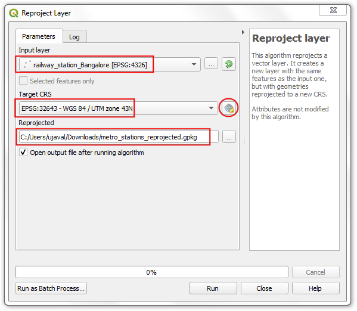
```

7. Once the reprojected layer ``metro_stations_reprojected`` is created, search for the **Vector geometry &rarr; Buffer** algorithm and double-click to launch the algorithm.

```{r echo=FALSE, fig.align='center', out.width='75%'}
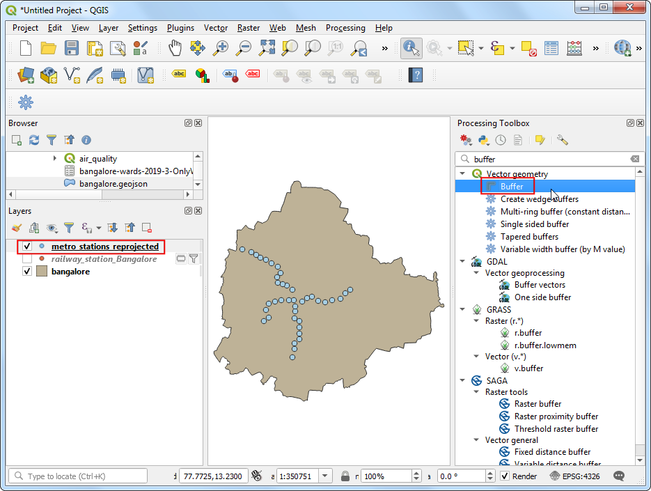
```

8. Select ``metro_stations_reprojected`` as the *Input layer*. Enter ``1 kilometers`` as the *Distance*. Check the *Dissolve result* option and name the *Buffered* output layer as ``metro_stations_buffer.gpkg``. click *Run*.

```{r echo=FALSE, fig.align='center', out.width='75%'}
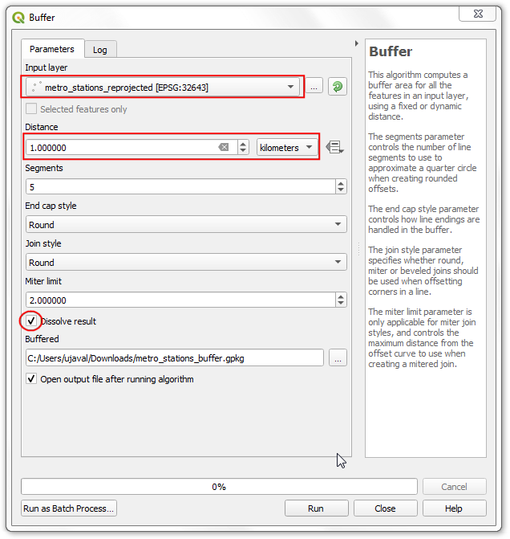
```

9. The layer now has a polygon representing areas within 1km of a metro station. Now that we are done with the geoprocessing operation, let's convert the result back to the original projection so we can use it along with other layers. Search for **Vector general &rarr; Reproject layer** algorithm and launch it.

```{r echo=FALSE, fig.align='center', out.width='75%'}
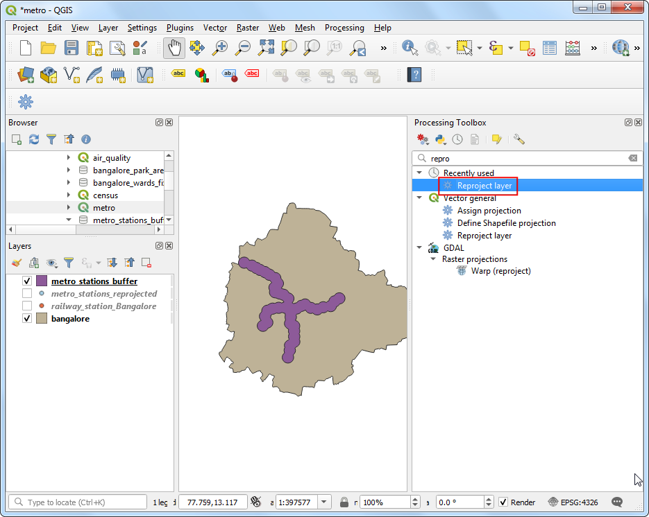
```

10. Select ``metro_stations_buffer`` as the *Input layer* and ``EPSG:4326 -WGS 84`` as the *Target CRS*. Name the output as ``metro_station_buffer_reprojected.gpkg``. Click *Run*.

```{r echo=FALSE, fig.align='center', out.width='75%'}
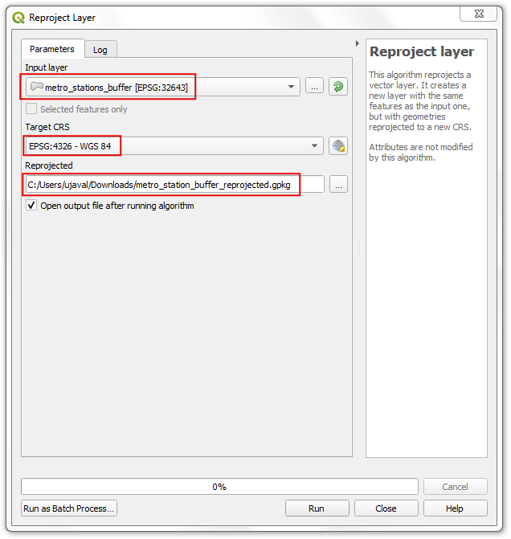
```

11. A new layer ``metro_station_buffer_reprojected`` will be added to the canvas that represents the area within 1 km of a metro station. We already have the ``bangalore`` layer representing the extent of the city. Now we are ready to extract the population data for both these layers.

```{r echo=FALSE, fig.align='center', out.width='75%'}
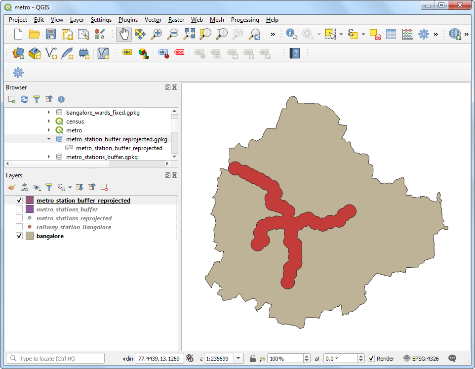
```

12. Locate the ``ind_ppp_2020_KA.tif`` in the *Browser* panel. Drag it to the canvas.

```{r echo=FALSE, fig.align='center', out.width='75%'}
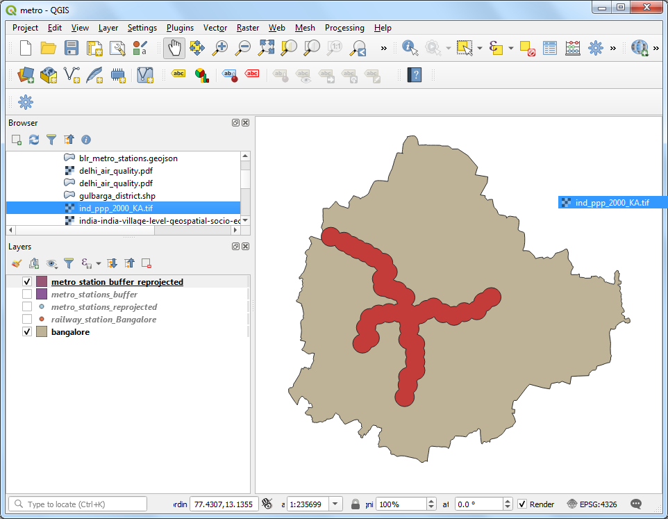
```

13. Select the ``ind_ppp_2020_KA`` layer and use the *Identify* tool to explore the pixel values. The resolution of the raster is roughly 100m x 100m. The raster layer has only 1 band and the pixel value is the estimated number of people within the 100 sq. m. area.

```{r echo=FALSE, fig.align='center', out.width='75%'}
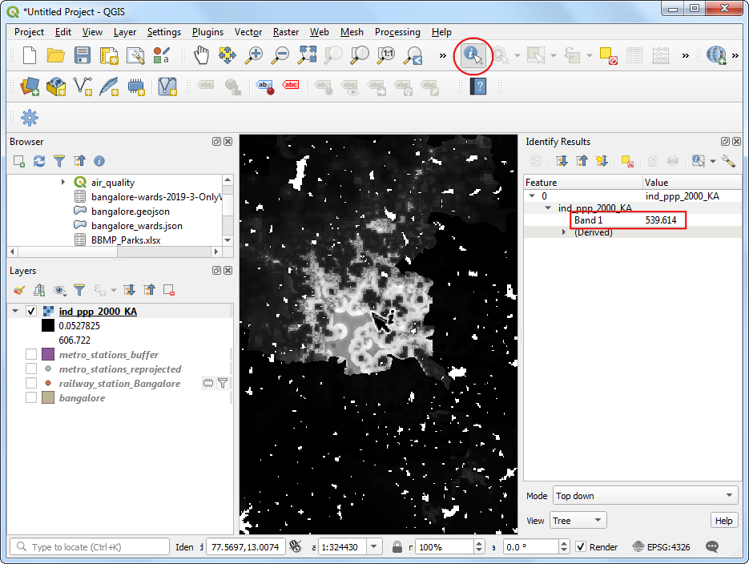
```

14. We can determine the total population by summing up the values from the pixels that fall within a polygon. This operation is known as *Zonal Statistics*. Search for and locate the **Raster analysis &rarr; Zonal statistics** algorithm. This algorithm would add a new attribute to each of these layers with the total population contained within the polygons. Double-click to launch it.

```{r echo=FALSE, fig.align='center', out.width='75%'}
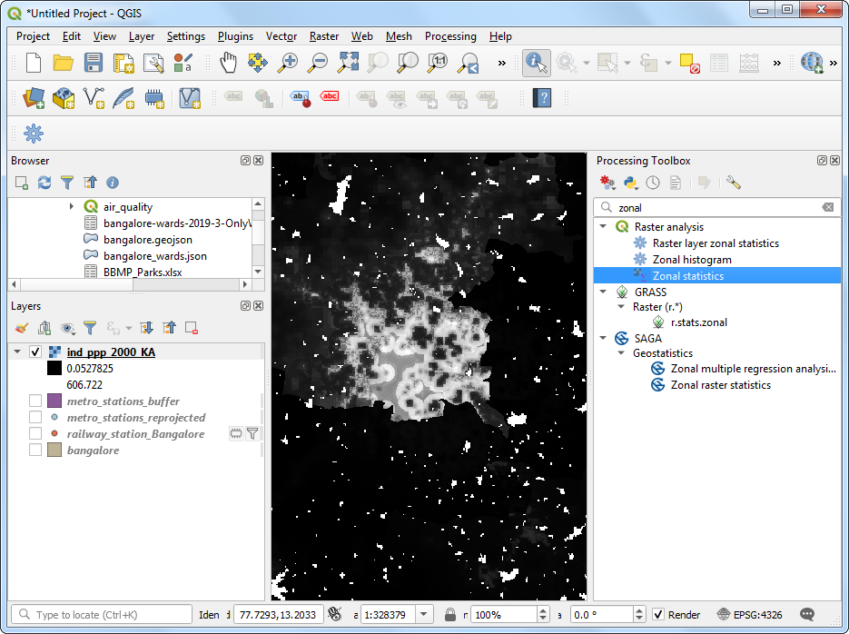
```

15. Select ``ind_ppp_2020_KA`` as the *Raster layer* and ``bangalore`` as the *Vector layer containing zones*. Enter ``population_`` as the *Output column prefix*. We are interested only in the ``Sum`` so uncheck other *Statistics to calculate*. Enter the output *Zonal Statistics* layer name as `bangalore_population.gpkg`. Click *Run*.

```{r echo=FALSE, fig.align='center', out.width='75%'}
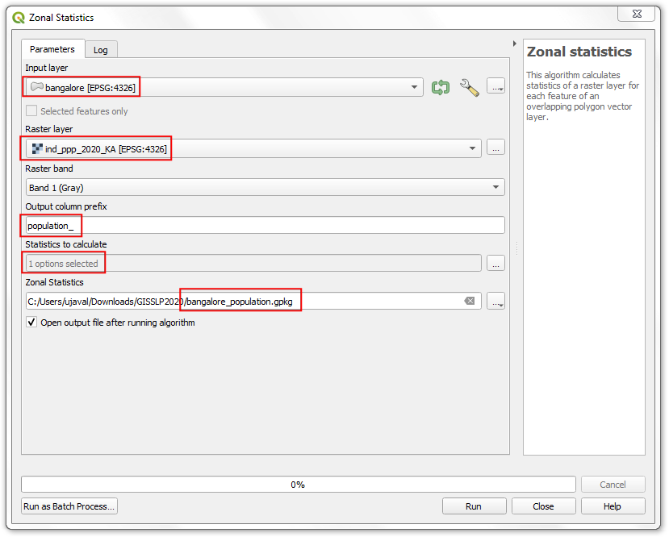
```

16. Once the algorithm finishes, select the ``metro_station_buffer_reprojected`` layer and repeat the same process. Enter the output layer name as `metro_station_buffer_population.gpkg`.

```{r echo=FALSE, fig.align='center', out.width='75%'}
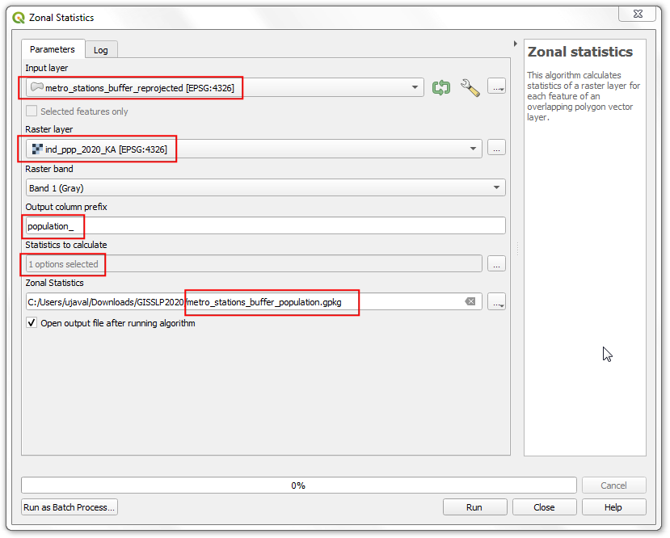
```

17. Now you will have 2 new layers `metro_station_buffer_population` and `bangalore_population` with a new field `population_sum`. Use the *Identify* tool and click on the polygons. The **population_sum** field from each of these layers contain the population. You can right-click on it and select *Copy Attribute Value*.

```{r echo=FALSE, fig.align='center', out.width='75%'}
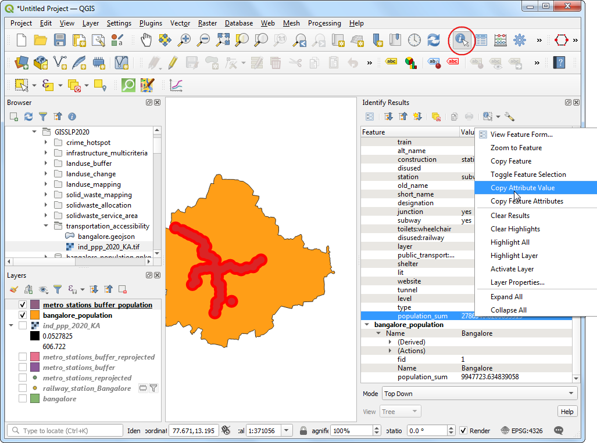
```

18. QGIS has a built-in calculator. Click on the *Locator* box at the bottom-left of the window and type ``= ``. Paste the population totals from the metro station buffer and the city polygon. The result is the percentage of population that lives within 1km of a metro station.

```
= 100 * pasted value from from metro station buffer / pasted value from bangalore 
```

```{r echo=FALSE, fig.align='center', out.width='75%'}
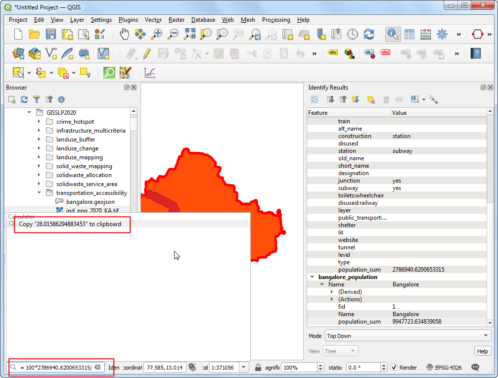
```


\newpage


## Data Credits

* OSM Tile Layer, Bangalore Metro Stations : (c) OpenStreetMap contributors
- Bangalore Ward Maps Provided by [Spatial Data of Municipalities (Maps) Project](http://projects.datameet.org/Municipal_Spatial_Data/) by Data{Meet}.
- Karnataka Population Grid 2020: Downloaded from [WorldPop](https://www.worldpop.org/geodata/summary?id=6527) - School of Geography and Environmental Science, University of Southampton; Department of Geography and Geosciences, University of Louisville; Departement de Geographie, Universite de Namur) and Center for International Earth Science Information Network (CIESIN), Columbia University (2018). Global High Resolution Population Denominators Project - Funded by The Bill and Melinda Gates Foundation (OPP1134076). https://dx.doi.org/10.5258/SOTON/WP00645

***